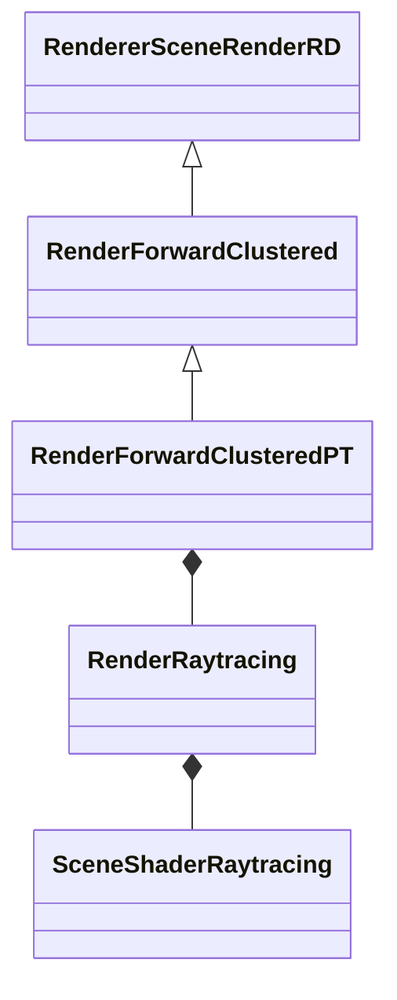
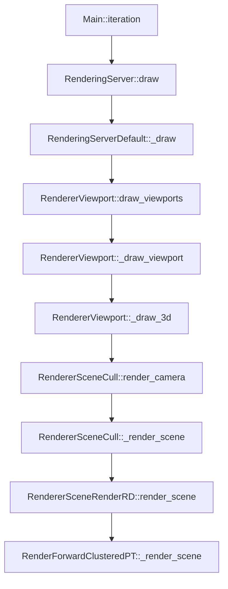
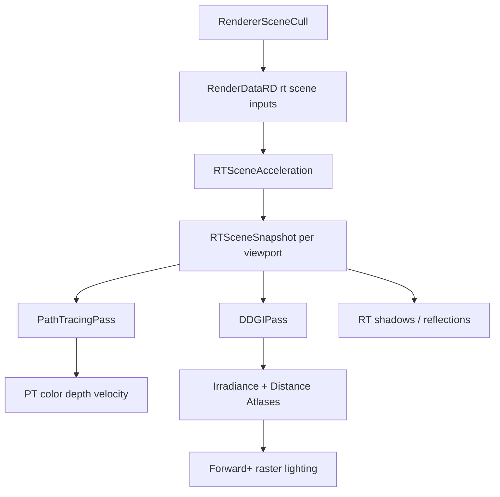
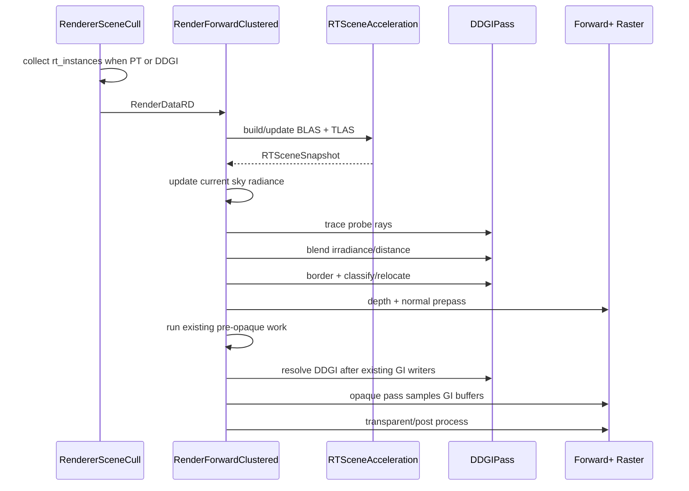

# NVIDIA 分支 Path Tracing / Ray Tracing 接入与 DDGI 集成指南

> 面向第一次阅读 Godot 渲染源码的开发者。  
> 源码快照：`nvidia-pt-dlss`，`b5325c3f6d`。  
> Godot 版本：`4.8-dev`（`version.py`）。  
> 上游基线：`c3e6b2c093`。  
> 本文只描述当前仓库实际代码；“DDGI 设计”章节是建议方案，不代表仓库已经实现。

## 阅读导航

- [0～2：结论、基础名词和分支范围](#0-先给结论)
- [3～5：Path Tracing 接入点、RenderServer 参数链和逐帧调用链](#3-path-tracing-是如何替换-forward-的)
- [6～11：TLAS、材质、RenderingDevice、Shader、算法和 DLSS](#6-场景如何变成-tlas)
- [12～15：enum/ClassDB 注册与 GDScript/C# 调用](#12-为什么源码中到处都在注册-enum)
- [16：当前 Ray Query 测试代码](#16-当前本地-_rayqueryglsl-测试在做什么)
- [17～25：DDGI 总体架构、资源、Shader、帧时序和同步](#17-ddgi-在这个-renderer-中应当是什么角色)
- [26～29：DDGI API、RenderingServer 注入与未来 Volume Node](#26-ddgi-environment-api-建议)
- [30～32：实现阶段、提交拆分和风险](#30-分阶段实现计划与验收标准)
- [33～36：当前分支问题、调试方法、阅读顺序和最终建议](#33-当前分支值得先确认或修复的问题)

---

## 0. 先给结论

1. 这里的 Path Tracing 不是一个新的 Godot `rendering_method`。
  在硬件满足 clustered renderer 的纹理数要求时，Forward+ 仍然是
   `forward_plus`，但具体实现从 `RenderForwardClustered` 换成了其子类
   `RenderForwardClusteredPT`；纹理数不足时仍会回退 Mobile。
2. Path Tracing 的用户开关属于 `Environment`：
  `Environment.pathtracing_enabled`。`WorldEnvironment` 只是把
   `Environment` 资源挂进当前 `World3D/Scenario`。
3. 当 `use_rt` 门控成功时，PT 帧的主链路是：
  ```text
   Main
     -> RenderingServerDefault
     -> RendererViewport
     -> RendererSceneCull
     -> RendererSceneRenderRD
     -> RenderForwardClusteredPT
     -> RenderRaytracing
     -> RenderingDevice / RenderingDeviceGraph
     -> RenderingDeviceDriverVulkan
     -> vkCmdTraceRaysKHR
  ```
4. `RenderRaytracing` 已经提供了 DDGI 最难的场景侧基础：
  BLAS/TLAS、标准材质快照、Bindless 纹理、灯光数据、变形网格、
   MultiMesh 和每 Viewport 的 RT 场景状态。
5. 但它目前被 Path Tracing 紧密包住：
  - 只有 `pathtracing_enabled == true` 才收集 `rt_instances`；
  - 只有 PT 分支才调用 `_setup_rt()` 和 `build_tlas()`；
  - `RenderRaytracing` 由 `RenderForwardClusteredPT` 私有持有；
  - `build_tlas()` 又依赖 `SceneShaderRaytracing` 的 pipeline/SBT。
6. 所以 DDGI 不能只写进
  `RenderForwardClusteredPT::_render_scene()` 的 `use_rt == true` 分支。
   真正用于游戏的 DDGI 应当在 **Path Tracing 关闭、Forward+ 光栅化开启**
   时更新探针并供 opaque shader 采样。
7. 推荐实现顺序：
  - 先让现有 Ray Query 测试在 **PT 关闭的光栅路径**中工作；
  - 再把 RT 场景构建抽成 PT/DDGI 共用服务；
  - 先做单个、相机跟随的 DDGI 网格；
  - 先把结果写入现有 GI ambient buffer；
  - 最后再做 `DDGIVolume3D`、多体积、透明物体、Fog、重定位和分类。
8. 当前 Linux 构建可以运行 Vulkan Path Tracing，但不能使用此分支的
  Streamline/DLSS Ray Reconstruction。`SConstruct:608-612` 明确只在
   Windows 定义 `STREAMLINE_ENABLED`。Linux 调试时应把 denoiser 设为
   `PT_DENOISER_NONE`，也不要把 Viewport scaling 设为 DLSS。

---

## 1. 零基础需要先认识的 Godot 渲染名词

### 1.1 Node、Resource 和 RID

- `WorldEnvironment` 是场景树中的 **Node**。
- `Environment` 是可复用、可序列化的 **Resource**。
- `Environment` 在构造时向 `RenderingServer` 申请一个 **RID**：
`scene/resources/environment.cpp:1739-1759`。
- RID 不是 C++ 指针，也不是场景节点；它是 RenderServer 内部资源的句柄。
- 场景层保存便于编辑器和脚本使用的字段，RenderServer storage 保存渲染线程
真正读取的字段。

可以把它理解为：

```text
WorldEnvironment Node
    持有 Ref<Environment>
        持有一个 Environment RID
            指向 RendererEnvironmentStorage::Environment
```

### 1.2 RenderingServer、Renderer 和 RenderingDevice 不是同一层

- `RenderingServer`
  - 面向场景、GDScript、C# 和 GDExtension 的高层服务 API。
  - 负责线程转发和 RID API。
- `RenderingMethod` / `RendererSceneCull`
  - 管相机、Scenario、实例、可见性、LOD、灯光和场景剔除。
- `RendererSceneRenderRD`
  - 把剔除结果整理为 `RenderDataRD`，交给具体 RD renderer。
- `RenderForwardClustered` / `RenderForwardClusteredPT`
  - Forward+ 具体帧流程。
- `RenderingDevice`，源码里常写成 `RD`
  - GPU 资源和命令的 API 无关抽象。
  - `rendering_device.h:2100` 附近的 `typedef RenderingDevice RD;` 表明
  `RD` 只是别名，不是另一个对象。
- `RenderingDeviceGraph`，简称 RDG
  - 记录资源读写关系，安排 barrier 和命令顺序。
- `RenderingDeviceDriverVulkan`
  - 把 RD 命令落到 Vulkan。

### 1.3 BLAS、TLAS、SBT 和 BDA

- BLAS：某一份三角形或 AABB 几何的底层加速结构。
- TLAS：把多个 BLAS 加上世界变换、mask、instance ID 组织为场景。
- SBT：Shader Binding Table。决定某个 TLAS 实例命中时执行哪个 hit group。
- BDA：Buffer Device Address。Shader 用 64 位 GPU 地址间接读取顶点、索引和
自定义材质参数。

当前分支里有一个非常重要的映射：

```text
TLAS instance.id
  -> gl_InstanceCustomIndexEXT
  -> geometries[id]
  -> materials[id]
  -> motion_indices[id]
```

因此 TLAS 实例顺序与三个 SSBO 的顺序必须完全一致。

---

## 2. 当前分支到底增加了什么

### 2.1 提交边界

`c3e6b2c093..HEAD` 上有四个提交：


| 提交           | 内容                          | 判断                        |
| ------------ | --------------------------- | ------------------------- |
| `6d1005697f` | `NVIDIA: Miscellaneous`     | NVIDIA 基础/CI 等杂项          |
| `5e232ffd61` | `NVIDIA: Dependencies`      | Streamline 头文件、SPIR-V 等依赖 |
| `135dff3887` | `NVIDIA: Pathtracer + DLSS` | PT/RT/DLSS 主实现            |
| `b5325c3f6d` | Ray Query 测试、`flake.nix`    | 当前仓库自己的 DDGI 前置实验         |


核心 PT 提交修改约 191 个文件。相对上游，`servers/`、`scene/`、
Vulkan 和文档部分约增加 1.5 万行。

### 2.2 主要源码区域


| 主题                         | 关键文件                                                |
| -------------------------- | --------------------------------------------------- |
| Forward+ PT 帧入口            | `render_forward_clustered_pt.{h,cpp}`               |
| RT 场景、BLAS/TLAS、材质和灯光      | `render_raytracing.{h,cpp}`                         |
| Pipeline、SBT、自定义 hit group | `scene_shader_raytracing.{h,cpp}`                   |
| PT GPU 程序                  | `shaders/raytracing/*.glsl`                         |
| 底层 RT API                  | `rendering_device*.{h,cpp}`                         |
| Vulkan 实现                  | `drivers/vulkan/rendering_device_driver_vulkan.cpp` |
| 用户环境 API                   | `scene/resources/environment.{h,cpp}`               |
| RenderServer storage       | `storage/environment_storage.{h,cpp}`               |
| 场景剔除                       | `renderer_scene_cull.{h,cpp}`                       |
| DLSS / Ray Reconstruction  | `effects/dlss.{h,cpp}`、`drivers/streamline/*`       |
| 程序化 RT 几何                  | `scene/3d/rt_procedural_instance_3d.{h,cpp}`        |
| 本仓库实验                      | `_rayquery.glsl` 和 PT 类中的 `test_*`                  |


### 2.3 本仓库还没有 DDGI

当前源码没有 `DDGI` 类、资源、shader 或 RenderServer API。
`b5325c3f6d` 只增加了：

- 一个固定 512×512 的 compute Ray Query shader；
- 在 PT 类中绑定现有 TLAS 的测试函数；
- 被注释掉的 dispatch 和画面拷贝；
- Linux/Nix 开发环境。

它证明“compute shader 可以查询 TLAS”的方向，但还没有：

- 探针网格；
- 辐照度/距离 atlas；
- 历史混合；
- visibility moments；
- relocation/classification；
- Forward+ 材质采样；
- PT 关闭时的 TLAS；
- 对外 DDGI API。

---

## 3. Path Tracing 是如何替换 Forward+ 的

### 3.1 Renderer 选择

`RendererCompositorRD::RendererCompositorRD()` 在
`renderer_compositor_rd.cpp:377-393` 读取当前 rendering method：

```text
mobile 或纹理数不足 48
    -> RenderForwardMobile

forward_plus
    -> RenderForwardClusteredPT

其他未知 RD method
    -> 报错后回退 RenderForwardClusteredPT
```

类关系：




这意味着：

- 当实际 rendering method 是 `forward_plus` 且
`LIMIT_MAX_TEXTURES_PER_SHADER_STAGE >= 48` 时创建 PT 版本；
- 纹理数不足时即使项目选择 Forward+ 也会回退 `RenderForwardMobile`，
此时 `pathtracing_*` 只会被保存，不会产生 PT 输出；
- 但默认仍走光栅化；
- 是否真正 trace rays，是每个 view、每一帧根据 Environment 决定的。

### 3.2 每帧 PT 门控

`render_forward_clustered_pt.cpp:97-125` 的 `use_rt` 必须同时满足：

1. 不是 ReflectionProbe 渲染；
2. `RenderDataRD.environment` 有效；
3. storage 中 `pathtracing_enabled == true`；
4. `_setup_rt()` 成功；
5. `_setup_rt()` 要求 `RD::SUPPORTS_RAYTRACING_PIPELINE`。

失败时：

```text
清理/老化 motion 状态
释放 DLSS-RR guide buffer
关闭 depth reconstruction
调用 RenderForwardClustered::_render_scene()
```

所以 `RenderForwardClusteredPT` 更准确的理解是：

```text
Forward+ 光栅 renderer
    + 一个按 Environment 切换的 PT opaque 路径
    + DLSS-RR guide/output
```

它不是完全独立的 renderer。

---

## 4. 从 WorldEnvironment 到 RenderServer 的参数写入链

### 4.1 `Environment` 自身保存一份用户状态

`scene/resources/environment.h:193-199`：


| 字段                              | 默认值                                   |
| ------------------------------- | ------------------------------------- |
| `pathtracing_enabled`           | `false`                               |
| `pathtracing_debug_mode`        | `RT_DEBUG_DISABLED`                   |
| `pathtracing_samples_per_pixel` | `1`                                   |
| `pathtracing_max_bounces`       | `3`                                   |
| `pathtracing_denoiser`          | `PT_DENOISER_DLSS_RAY_RECONSTRUCTION` |


每个 setter 最后调用 `_update_pathtracing()`：
`environment.cpp:606-660`。

### 4.2 完整写入链

```mermaid
flowchart LR
    A[Inspector / GDScript / C#] --> B[Environment setter]
    B --> C[Environment::_update_pathtracing]
    C --> D[RS::environment_set_pathtracing]
    D --> E[RenderingServerDefault FUNC6]
    E --> F[CommandQueueMT]
    F --> G[RendererSceneCull PASS6]
    G --> H[RendererSceneRender]
    H --> I[RendererEnvironmentStorage]
    I --> J[storage Environment fields]
```




逐层位置：

1. `scene/resources/environment.cpp:1491-1509`
  - `ClassDB::bind_method`；
  - `ADD_PROPERTY`；
  - Inspector 的 `Pathtracing` 分组。
2. `scene/resources/environment.cpp:653-660`
  - 一次把五个参数发给 `RS::environment_set_pathtracing()`。
3. `servers/rendering/rendering_server.h:694-695`
  - 声明脚本/服务层虚接口。
4. `servers/rendering/rendering_server_default.h:820-895`
  - `ServerName = RenderingMethod`；
  - `server_name = RSG::scene`；
  - `FUNC6(environment_set_pathtracing, ...)`。
5. `servers/server_wrap_mt_common.h:567-576`
  - `FUNC6` 展开后，如果调用者不在 render thread，就把命令放入
   `CommandQueueMT`；
  - 已在 render thread 时直接调用；
  - `RenderingServerDefault::sync()` 会 flush/sync 队列，
  见 `rendering_server_default.cpp:434-440`。
6. `servers/rendering/renderer_scene_cull.h:1388-1395`
  - `PASS6` 再转给 `scene_render`；
  - `PASS1RC` 提供 C++ 内部 getter。
7. `servers/rendering/renderer_scene_render.cpp:710-733`
  - 转给 `RendererEnvironmentStorage`。
8. `servers/rendering/storage/environment_storage.cpp:899-939`
  - 真正写入渲染端 Environment。

### 4.3 为什么同一个值看起来存了两遍

这是 Godot 的线程和架构边界：`Environment`：编辑器、序列化、脚本 getter 用；

- Renderer storage `Environment`：render thread 快速读取；
- `RenderingServerDefault`：把主线程修改安全地送到 render thread。

自己加 DDGI API 时也应该遵守这条链，不能让 renderer 直接持有
`scene/resources/environment.h` 中的对象指针。

### 4.4 `WorldEnvironment` 如何让它生效

`WorldEnvironment` 不拥有任何 `pathtracing_*` 字段。

链路是：

```text
WorldEnvironment.environment
  -> WorldEnvironment::_update_current_environment()
  -> World3D::set_environment()
  -> RS::scenario_set_environment(scenario, environment RID)
  -> RendererSceneCull::_render_get_environment()
  -> RenderDataRD.environment
```

关键位置：

- `scene/3d/world_environment.cpp:77-86`
- `scene/resources/3d/world_3d.cpp:87-99`
- `renderer_scene_cull.cpp:3815-3832`

环境优先级：

1. 当前 Camera3D 自己的 Environment；
2. Scenario/WorldEnvironment 的 Environment；
3. Scenario fallback Environment。

因此 Camera3D 有独立 Environment 时，修改 WorldEnvironment 可能看不到效果。

---

## 5. 一帧的完整调用链

### 5.1 主循环到具体 renderer




对应源码：

1. `main/main.cpp:5131-5141`
  - 调用 `RenderingServer::draw()`。
2. `rendering_server_default.cpp:75-115`
  - scene update；
  - probes；
  - `RSG::viewport->draw_viewports()`；
  - end frame。
3. `renderer_viewport.cpp:789-910`
  - 过滤 active/visible Viewport；
  - 设置 debug draw；
  - 调用 `_draw_viewport()`。
4. `renderer_viewport.cpp:344-414`
  - 创建和配置 `RenderSceneBuffersRD`；
  - `_draw_3d()`。
5. `renderer_viewport.cpp:312-341`
  - `RSG::scene->render_camera(...)`。
6. `renderer_scene_cull.cpp:2698-2812`
  - 建 CameraData、projection、TAA jitter；
  - 解析 Camera/World Environment；
  - 进入 `_render_scene()`。
7. `renderer_scene_cull.cpp:3381-3799`
  - 可见性和 RT 范围剔除；
  - 阴影和 SDFGI region 数据；
  - 调用 `scene_render->render_scene(...)`。
8. `renderer_scene_render_rd.cpp:1400-1547`
  - 组装 `RenderSceneDataRD` 和 `RenderDataRD`；
  - 将普通实例与 `rt_instances/rt_lights` 一起传入；
  - 虚调用 `_render_scene()`，最终进入 PT 子类。

### 5.2 PT 分支内部的帧顺序

`render_forward_clustered_pt.cpp:97-559`：

1. 判断 `use_rt`，否则回退基类光栅流程。
2. 获取 Forward+ render buffer 和 cluster builder。
3. 确定是否需要 motion vectors、TAA 和 upscaling。
4. 清掉 PT 替代的 SSIL、SSAO、SSR render-buffer context。
5. 更新 lightmap、Environment UBO 和基础 uniform set。
6. `_fill_render_list(..., p_alpha_only=true)`：
  - opaque 不进入光栅 color list；
  - 通常只留下 `FLAG_PASS_ALPHA` 的透明 overlay；
  - 但 visibility-range/parent fade 会把 opaque surface 强制加入 alpha
  list，而当前 TLAS 仍保留该 surface，可能形成 RT opaque 与 raster fade
  双重渲染。
7. `SceneShaderRaytracing::compute_rt_flags()`：
  - debug；
  - DLSS-RR；
  - fog；
  - SER；
  - simple ray-query shadows；
  - SPP 和 bounce 数。
8. 如果启用 DLSS-RR，创建四张 guide texture。
9. `RenderRaytracing::build_tlas()`：
  - 准备材质、几何；
  - 创建/更新 BLAS；
  - 创建/重建 TLAS；
  - 上传 geometry/material/motion SSBO。
10. `RenderRaytracing::update_uniform_set()`：
  - 上传灯光和参数；
    - 绑定 TLAS、输出、场景、材质、sky、depth、velocity 等；
    - finalize bindless set。
11. 准备透明物体所需的 raster light/cluster/decal。
12. 获取 RT pipeline 和 hit SBT。
13. 开始 `raytracing_list`，绑定 set 0、set 1。
14. 显式登记 BDA 间接读取的动态 buffer。
15. `raytracing_list_trace_rays(width, height, 1)`。
16. 把 RT R32F depth 拷入 Forward+ depth framebuffer。
17. 把 RT color 拷入 main internal color。
18. 执行 post-opaque compositor callback。
19. 光栅化透明物体。
20. 如需要，执行 DLSS/FSR2/TAA。
21. Tonemap。
22. 输出 debug view。

### 5.3 PT 替换了什么，保留了什么


| 模块                     | PT 开启后的行为                                                         |
| ---------------------- | ----------------------------------------------------------------- |
| Opaque color           | Ray Tracing 替代                                                    |
| Opaque depth           | closest-hit/miss 写 R32F，再拷到 depth                                 |
| Motion vectors         | PT shader 写                                                       |
| 透明物体                   | 仍使用 Forward+ 光栅化                                                  |
| SSAO / SSIL / SSR      | context 被清理，不再使用                                                  |
| SDFGI                  | 显式禁用，见 `render_forward_clustered.cpp:4167-4170`                   |
| 光栅 shadow atlas        | opaque PT 不采样，但 SceneCull 仍会更新/绘制 shadow map，供透明 Forward+ pass 使用 |
| Sky / fog              | PT shader 自己采样/计算                                                 |
| Post process / tonemap | 继续复用 Forward+                                                     |
| ReflectionProbe 自身渲染   | 回退光栅                                                              |


---

## 6. 场景如何变成 TLAS

### 6.1 RT 专用剔除集合

主相机 color pass 主要使用 frustum 可见集合；shadow caster、SDFGI region
等本来就有各自的专用剔除集合。PT 的相机 ray 还可能命中屏幕外物体，
所以又增加了一套更宽的 RT 集合。

`renderer_scene_cull.cpp:3439-3446`：

```text
cull.rt_enabled =
    environment 有效
    && environment.pathtracing_enabled

rt_aabb =
    以相机为中心
    半径为 camera z_far 的立方体
```

`renderer_scene_cull.cpp:3297-3338` 收集：

- `rt_geometry_instances`
  - Mesh；
  - MultiMesh；
  - 非 `CAST_SHADOWS_ONLY`；
- `rt_light_instances`
  - 非方向灯；方向灯来自普通 light list。

同时处理：

- 只检查实例是否占用低 20 个 game layer，以避免纯编辑器 gizmo 进入 TLAS；
- visibility range；
- visibility parent/LOD cross-fade；
- frustum 外但在 `rt_aabb` 内的物体；
- skin/deformation 更新需求。

当前 RT 分支没有像普通光栅剔除那样应用 Camera 的 `visible_layers`：
只要实例任一低 20-bit layer 有效，它仍可能进入 TLAS/RT light list。
因此 Camera cull mask 对 PT 几何和位置灯并不完全生效，这是现有实现缺口。

这两个数组通过：

```text
InstanceCullResult
 -> RendererSceneRender::render_scene 参数
 -> RendererSceneRenderRD::render_scene
 -> RenderDataRD.rt_instances / rt_lights
 -> RenderRaytracing::build_tlas
```

### 6.2 每 Viewport 的 RT 状态

`render_raytracing.h:293-322` 的 `RTViewportState` 包含：

- `tlas` 和容量；
- geometry SSBO；
- material SSBO；
- motion index SSBO；
- previous transform SSBO；
- light SSBO；
- path-tracing params UBO；
- scene uniform set；
- frame counter。

它以 `RenderSceneBuffersRD *` 为 key 存在
`RenderRaytracing::viewport_states` 中。

不能随意跨 Viewport 共用 TLAS：

- 每个 Viewport 的可见集合和 LOD 可能不同；
- `instanceCustomIndex` 对应的 SSBO 下标也不同；
- 错配会让 shader 读取错误的 BDA，严重时直接 GPU fault。

### 6.3 静态 Mesh

`process_surface()` 和 `_populate_surface_blas()`：

1. 从 `MeshStorage` 取得 vertex/attribute/index buffer；
2. 分析压缩格式、position stride、normal/tangent、UV 和 color offset；
3. 把 BDA 写入 `RT_GeometryData`；
4. 创建 triangle BLAS；
5. 静态几何偏向 `PREFER_FAST_TRACE`；
6. 通过 mesh RID/version/invalidation counter 缓存。

关键位置：

- `render_raytracing.cpp:611-674`
- `render_raytracing.cpp:820-1047`

### 6.4 Skinned / Blend Shape / 变形 Mesh

`process_deformed_surface()`，`render_raytracing.cpp:681-813`：

- 将引擎当前变形 VB 拷到 RT 自己拥有的 VB；
- 另存上一帧 position，用于 motion vector；
- 首次或拓扑变化执行 BLAS full build；
- 只有顶点内容变化时执行 `blas_update()`/refit；
- 创建 BLAS 时带 `ALLOW_UPDATE` 和 `PREFER_FAST_BUILD`；
- TTL 默认 60 帧，超时回收。

### 6.5 MultiMesh

两条路径：

1. **Merged BLAS**
  - compute shader 把每实例变换烘入合并后的顶点/TBN/attribute/index；
  - 一个 MultiMesh surface 变为一个较大的 BLAS；
  - transform 变化后 refit；
  - 总三角形不能超过
  `rendering/pathtracing/multimesh_merged_blas_max_triangles`。
2. **Expanded TLAS**
  - 共享一个 surface BLAS；
  - 每个 MultiMesh instance 建一个 TLAS entry。

Motion vector 还有已知限制：

- merged 路径把 `motion_indices` 固定为 `-1`；
- expanded 路径只保存父 GeometryInstance 的上一帧 transform，并复用当前
`mm_xform`；
- MultiMesh 每实例 transform 的上一帧数据没有完整进入 PT motion。

使用 DLSS-RR/TAA 时，移动 MultiMesh 可能产生 ghosting。

源码：

- `render_raytracing.cpp:1832-2221`
- `shaders/raytracing/multimesh_merge.glsl`

### 6.6 程序化 AABB 几何

`RTProceduralInstance3D`：

- 用一个零 surface 的 `ArrayMesh` 让 SceneCull 将它识别为 Mesh instance；
- 把一个或多个 AABB 上传为 BLAS geometry；
- 必须通过继承的 `material_override` 指定带 shader 的 `ShaderMaterial`；
- 该 Spatial Shader 需要提供 `intersection()`；
- `report_intersection(t, kind)` 向 RT pipeline 报告真实命中；
- 可选把每个 primitive 的 AABB 暴露给 shader。

缺少 `material_override`、shader ID 无效或 custom hit group 未 ready 时，
该 procedural instance 会被 TLAS 跳过。Compute Ray Query 也不会自动执行
它的 intersection shader。

链路：

```text
RTProceduralInstance3D
 -> RenderingServer.instance_set_rt_procedural*
 -> RendererSceneCull
 -> GeometryInstanceForwardClustered::RTProceduralState
 -> RenderRaytracing::update_procedural_blas
 -> custom intersection hit group
```

关键位置：

- `scene/3d/rt_procedural_instance_3d.cpp:97-119`
- `renderer_scene_cull.cpp:1122-1143`
- `render_raytracing.cpp:1311-1371`
- `scene_raytracing_raygen.glsl:572-701`

### 6.7 TLAS 构建与数组对齐

`build_acceleration_structures()`，`render_raytracing.cpp:1755-1796`：

```text
for dirty BLAS:
    blas_build()

for refit BLAS:
    blas_update()

if TLAS capacity 不足:
    以 needed * 2 重新创建

for i in all instances:
    instance.id = i
    instance.transform = transforms[i]
    instance.blas = blass[i]
    instance.flags = instance_flags[i]
    instance.hit_sbt_range.offset = sbt_offsets[i]

tlas_build()
```

随后 `finalize_buffers()` 按同样顺序上传 geometry/material/motion 数组。

---

## 7. 材质、纹理和灯光

### 7.1 标准材质

`RenderRaytracing::process_material()` 提供的是“按参数名抓取”的有限
StandardMaterial 快照，不是完整的 `BaseMaterial3D` feature parity。
它把下列常用数据转换到 96-byte `RT_MaterialData`：

- albedo texture/color；
- normal texture/depth；
- ORM 中的 roughness/metallic；
- 带 emission texture 时的 emission color/energy；
- metallic；
- roughness；
- specular；
- UV scale/offset；
- texture filter flag。

当前缺口包括：

- `ao_strength` 虽在结构中存在，但 PT shader 没有实际使用 AO；
- fallback `texture_roughness` 固定按 ORM 的 G channel 读取，
没有遵循完整 channel selector；
- 没有独立 metallic/AO texture parity；
- 没有 emission texture 时，closest-hit 不会只凭纯色 emission flag 发光；
- 代码用 `"albedo"` 参数是否为 `Color` 判断标准/自定义材质，
自定义 ShaderMaterial 若碰巧声明同名 uniform，可能被误分类。

CPU 定义：`render_raytracing.h:97-116`。  
GPU 镜像：`raytracing_data_inc.glsl:84-106`。

两边布局通过 `alignas(16)`、`static_assert(sizeof(...))` 和 `std430`
保持一致。自己加 DDGI 数据时也应这样做。

### 7.2 Bindless texture

`BindlessBlock` 把所有材质纹理放进 set 1 binding 0 的 runtime array：

```glsl
layout(set = 1, binding = 0) uniform texture2D bindless_textures[];
```

特点：

- index 0 是默认白纹理；
- 相同 RID 去重；
- 最大 128000；
- 纹理销毁后，下一帧把失效槽换成默认纹理并加入 free list；
- uniform set 失效时重新 finalize。

源码：`renderer_rd/bindless_block.{h,cpp}`。

### 7.3 自定义 ShaderMaterial

当前分支不只是“所有材质都退回白色”，而是扩展了 Shader 编译链：

1. `scene/resources/shader.cpp:95-118`
  - 原 shader 正常预处理一次；
  - 再定义 `RT=1` 预处理一次。
2. `MaterialStorage::shader_set_code_rt()`
  - 保存 RT source；
  - 建 128-bit source hash；
  - 增加材质 invalidation counter。
3. `SceneShaderForwardClustered::ShaderData::set_code_rt()`
  - 只做 RT 侧 opaque/alpha/cull 分类；
  - 不改变 raster pipeline。
4. `SceneShaderRaytracing::_preprocess_shader()`
  - 把 Spatial Shader 的 vertex/fragment/intersection 代码编译为可注入片段。
5. `_make_pipeline_build_task()`
  - 把代码注入 closest-hit、any-hit、intersection 模板；
  - 为每种 source hash 分配稳定 hit-group slot；
  - 自定义 uniform 被打进 UBO，再以 BDA 读取；
  - sampler2D 转成 bindless index。
6. pipeline 可异步重建。

需要注意：

- 自定义 hit group 未 ready 时，当前 `build_tlas()` 会跳过该 surface；
并不是稳定地用默认材质替代；
- 不是所有 Spatial Shader 行为都天然适合 RT；
- screen/depth texture、复杂 vertex deformation、透明混合等仍有语义差异；
- DDGI compute Ray Query 不会自动执行这些 hit shader。

### 7.4 灯光

`gather_lights()`，`render_raytracing.cpp:2770-2951`：

- 最多 64 个灯；
- 方向灯先放入；
- 位置灯来自 `rt_lights`，按能量、亮度、range、距离和相机前后方向的
近似贡献评分；
- 它没有执行真实 frustum test；相机后方灯只是被降权；
- 输出 `RT_LightData[64]`。

`RT_LIGHTS_FRUSTUM_BUDGET`/`RT_LIGHTS_INDIRECT_BUDGET` 当前只有定义，
没有参与 `gather_lights()` 的选择逻辑。

Shader 使用：

- 随机抽最多 16 个候选灯；
- reservoir 选择一个有效灯；
- NEE 直接光采样；
- shadow ray；
- BRDF 评估。

当前限制：

- area light 没有独立 `RT_LIGHT_TYPE_AREA`；
- 非 spot 的位置灯会落入 omni 路径；
- emissive surface 能在路径命中时发光，但没有加入 NEE light sampling。

---

## 8. RenderingDevice 到 Vulkan 的 Ray Tracing 栈

### 8.1 能力与扩展

公共 Features：

- `SUPPORTS_RAY_QUERY`
- `SUPPORTS_RAYTRACING_PIPELINE`

定义：`rendering_device_commons.h:1025-1040`。  
Vulkan 判断：`rendering_device_driver_vulkan.cpp:7650-7653`。

Vulkan 请求：

- `VK_KHR_acceleration_structure`
- `VK_KHR_deferred_host_operations`
- `VK_KHR_ray_tracing_pipeline`
- `VK_KHR_ray_query`
- 可选 `VK_EXT_ray_tracing_invocation_reorder`
- 可选 `VK_NV_ray_tracing_validation`

见 `rendering_device_driver_vulkan.cpp:590-597`。

平台实际情况：


| Driver                 | 当前 RT pipeline     |
| ---------------------- | ------------------ |
| Vulkan / Windows、Linux | 已实现，硬件和驱动还需支持      |
| Vulkan / macOS、iOS     | 编译期关闭              |
| D3D12                  | 方法存在但实现为“不支持” stub |
| Metal                  | 方法存在但实现为“不支持” stub |
| Compatibility / GLES3  | 无该 PT 路径           |


### 8.2 RD 的加速结构 API

`RenderingDevice` 提供：

- `blas_create/build/update`
- `tlas_create/build`
- triangle 和 AABB geometry；
- AS flags；
- instance mask/flags/custom ID/SBT range；
- buffer dependency 和 RID dependency。

重要约束：

- BLAS/TLAS build 不能发生在活跃 draw/compute/raytracing list 内；
- refit 只允许创建时声明 `ALLOW_UPDATE` 且拓扑不变；
- TLAS 中的 BLAS 必须已经 build，不能处于 invalidated 状态；
- 输入 buffer 被销毁或 BLAS 重建会让依赖的 TLAS 失效。

见 `rendering_device.cpp:306-646`。

### 8.3 RDG 自动同步

`RenderingDeviceGraph` 为：

- geometry buffer -> BLAS build；
- BLAS -> TLAS build；
- TLAS -> shader read；
- SBT -> trace；
- storage image/buffer 的读写

建立资源 usage 和 barrier。

关键位置：

- `rendering_device_graph.cpp:1790-1841`
- `rendering_device_graph.cpp:1843-1870`
- `rendering_device_graph.cpp:1992-2001`

### 8.4 BDA 是同步盲区

RDG 只能看到 descriptor/RID 中显式出现的资源。
`RT_GeometryData` 中存的是 64-bit GPU 地址，所以图无法知道 shader
还会读取哪些 VB/IB/custom UBO。

因此 PT dispatch 前调用：

`RenderRaytracing::register_raytracing_buffer_dependencies()`，
`render_raytracing.cpp:3288-3332`。

它显式登记：

- material UBO pool；
- deformed owned/previous VB；
- merged MultiMesh vertex/attribute/index buffer。

但 custom material UBO 大于 512 bytes或 pool 耗尽时会创建独立
`RTMaterialData::uniform_buffer`，当前函数没有登记这些 dedicated UBO。
这是现有 PT 中仍然存在的隐藏 BDA 同步缺口。

这是实现 DDGI 时最容易造成“偶尔花屏、某些 GPU 正常、某些 GPU 崩溃”的地方。
普通 `compute_list_add_barrier()` 不能替代“告诉 RDG 这个隐藏的 BDA 资源被读取”。

### 8.5 Pipeline 和 SBT

`SceneShaderRaytracing` 为每个 packed `rt_flags` 维护一个
`PipelineBundle`：

- pipeline；
- hit SBT；
- layout-defining base shader；
- 每个 custom hit-group 的 shader；
- ready mask。

初始 pipeline：

- 1 raygen；
- 1 miss；
- default hit group；
- empty sentinel hit group；
- hit SBT 初始容量 4096。

异步 custom pipeline 完成后：

- hit group 0 是默认材质；
- 1..N 是自定义材质/程序化几何；
- 最后一项是 empty sentinel；
- SBT slot `i` 映射到 hit group `i`。

源码：

- `scene_shader_raytracing.cpp:820-915`
- `scene_shader_raytracing.cpp:915-1320`
- `rendering_device.cpp:5163-5444`

### 8.6 最终 Vulkan 调用

```text
RenderForwardClusteredPT
  -> RD::raytracing_list_trace_rays
  -> RenderingDeviceGraph::add_raytracing_list_trace_rays
  -> RenderingDeviceGraph::_run_raytracing_list_command
  -> RenderingDeviceDriverVulkan::command_trace_rays
  -> vkCmdTraceRaysKHR
```

位置：

- `render_forward_clustered_pt.cpp:396-412`
- `rendering_device.cpp:6654-6761`
- `rendering_device_graph.cpp:797-836`
- `rendering_device_driver_vulkan.cpp:6746-6754`

Vulkan SBT 分为：

- pipeline 内的 raygen region；
- pipeline 内的 miss region；
- 独立可更新的 hit SBT；
- callable region 当前为空。

---

## 9. Shader 是怎样进入 RT Pipeline 的

### 9.1 `.glsl.gen.h` 是构建生成物

`shaders/raytracing/SCsub`：

- 找出 `*_inc.glsl`；
- 找出真正的 shader 文件；
- 使用 `env.RD_GLSL()` 生成 `.glsl.gen.h`；
- include 变更会触发重新生成。

所以源码中：

```cpp
#include ".../scene_raytracing_raygen.glsl.gen.h"
```

不是手写头文件，而是把 GLSL 内嵌成 C++ `ShaderRD` 类。

本地 `_rayquery.glsl` 也因此生成 `RayqueryShaderRD`。

### 9.2 一个文件包含多个 RT stage

`scene_raytracing_raygen.glsl` 使用：

```text
#[raygen]
#[miss]
#[closest_hit]
#[any_hit]
#[intersection]
```

`ShaderRD::setup_raytracing()` 和 `_build_variant_stage_sources()` 将它们拆成
五个 SPIR-V stage，见 `shader_rd.cpp:184-207`、`340-387`。

### 9.3 Shader stage 职责

- raygen
  - 从像素生成相机射线；
  - 每像素执行 SPP 循环；
  - 驱动 bounce 循环；
  - 最后写 color。
- miss
  - 终止路径；
  - 采样 sky radiance；
  - 写 primary miss 的 depth/velocity/DLSS guide 默认值；
  - shadow ray miss 表示可见。
- closest-hit
  - 用 `instanceCustomIndex` 取 geometry/material；
  - 重建 UV、TBN、normal、world hit position；
  - 执行材质；
  - emissive、NEE、BRDF sampling；
  - 给 raygen 返回下一条射线。
- any-hit
  - alpha test；
  - 必要时 `ignoreIntersectionEXT`。
- intersection
  - 执行用户 `intersection()`；
  - 对 AABB primitive 报告真实 hit。

### 9.4 Specialization flags

`SceneShaderRaytracing::RaytracingFlags`：

```text
bits  0..20 : feature flags
bits 21..28 : samples per pixel
bits 29..31 : max bounces - 1
```

feature flags：

- debug；
- DLSS-RR；
- fog；
- SER；
- Ray Query shadows。

它作为 `constant_id = 0` 的 specialization constant 创建 pipeline。
SPP 和 bounce 改变也会形成不同的 pipeline key，不只是普通 UBO 参数变化。

### 9.5 SER

启用 `rendering/pathtracing/use_shader_execution_reordering` 时：

- 生成 `USE_SER` shader variant；
- raygen 使用 `hitObjectTraceRayEXT`；
- `reorderThreadEXT` 按近似 instance hint 重排；
- 再执行 hit shader。

这是 NVIDIA 定向优化，不应把它当成所有支持 RT 的 GPU 都必然支持的功能。

---

## 10. Path Tracing 算法本身

### 10.1 Raygen 主循环

`scene_raytracing_raygen.glsl:29-102`：

```text
for sample in samples_per_pixel:
    radiance = 0
    throughput = 1
    rng = hash(pixel, frame, sample)

    for bounce:
        trace primary/next ray
        unpack payload
        if terminated:
            break
        reconstruct hit position
        offset origin
        use next direction

average all samples
store output
```

当前 primary ray 总是像素中心；源码已有 TODO：
SPP > 1 时，第一条相机射线相同，随机性主要发生在后续材质/灯光采样。

### 10.2 32-byte payload

`raytracing_inc.glsl:27-84` 的 `PathPayload`：

- radiance + throughput 用 FP16 打包；
- bounce/flags；
- RNG；
- hit distance；
- offset normal 的 oct16；
- next direction 的 oct16。

raygen 不让 closest-hit 直接改下一条 Vulkan ray，而是：

1. closest-hit 将 hit distance、normal、next direction 放回 payload；
2. raygen 根据当前 origin/direction 重建 hit point；
3. 使用 Wachter-Binder offset 防止自相交；
4. 发下一次 trace。

### 10.3 closest-hit 着色

`raytracing_closest_hit_common_inc.glsl:443-592`：

1. shading normal 朝 geometry normal 做 grazing clamp；
2. 对当前 ray segment 施加 fog；
3. 累加 emissive；
4. 检查 bounce 上限；
5. 构建 metallic/roughness BRDF 参数；
6. primary sample 0 写 DLSS-RR guide；
7. NEE 采样一个灯并发 shadow ray；
8. 在 diffuse/specular lobe 之间按能量概率选择；
9. importance sample BRDF；
10. 更新 throughput；
11. 返回下一条 ray。

当前实现特性：

- direct lighting 使用 NEE；
- diffuse/specular importance sampling；
- 最多 2 次 diffuse bounce 是硬编码：
`MAX_DIFFUSE_BOUNCES = 2`；
- 没有 Russian roulette；
- below-hemisphere sample 有 normal clamp 和 mirror recovery；
- emissive 几何不是显式 light sampler；
- sky 用 Godot radiance octmap。

### 10.4 Shadow Ray 的三条路径

`raytracing_lights_inc.glsl:185-249`：

1. `USE_RAY_QUERY_SHADOWS`
  - compute-style inline Ray Query；
  - 更快；
  - alpha 只做简化纹理测试。
2. `USE_SER`
  - hit object trace。
3. 普通 RT pipeline
  - `traceRayEXT`；
  - skip closest-hit；
  - any-hit 做 alpha；
  - miss 把 payload 设为“light visible”。

### 10.5 当前没有 PT 自己的历史累积

这是阅读代码时很容易误判的一点。

- `frame_counter` 只是进入 RNG seed；
- `imageStore` 每帧覆盖 color；
- 没有读取上一帧 PT color 并做 running average；
- 只有 DLSS-RR 在 DLSS 路径真正执行时提供 PT-aware temporal denoise；
- TAA/FSR2 是通用 temporal AA/upscaling，不能视为等价的 Path Tracing denoiser。

因此在 Linux 上关闭 DLSS-RR 后，1 SPP 会持续看到每帧变化的噪声，
不是“停住相机后无限收敛”。

---

## 11. PT 输出、透明叠加和 DLSS

### 11.1 输出资源

`RenderRaytracing` 在 RenderSceneBuffers 上创建：

- `RB_TEX_RAYTRACING`
  - PT HDR color；
- `RB_TEX_RT_DEPTH`
  - R32F depth；
- main velocity buffer
  - RG16F；
- 可选 DLSS-RR：
  - diffuse albedo；
  - specular albedo；
  - normal + roughness；
  - specular hit distance。

输出顺序：

```text
trace
 -> RT depth 拷到 D32F framebuffer
 -> RT color 拷到 internal texture
 -> transparent raster
 -> DLSS/FSR2/TAA
 -> tonemap
 -> debug draw
```

### 11.2 为什么透明物体仍是光栅

Path Tracing 的 TLAS 构建通常会跳过被分类到 `FLAG_PASS_ALPHA` 的 surface，
PT 类再把这些 surface 放进 alpha render list，最后用 Forward+ 画在 PT
opaque color/depth 上。

例外是 visibility-range/parent fade：`_fill_render_list()` 会把原本 opaque 的
surface 强制加入 alpha list，但 `build_tlas()` 仍只按 `FLAG_PASS_ALPHA`
排除它，因此同一 surface 可同时存在于 TLAS 和 raster fade overlay。
这是当前 fade 集成缺口。

好处：

- 复用 Godot 已有透明排序和 blending；
- 避免路径追踪复杂的透射/多层透明。

代价：

- 透明物体不参与 PT 的间接遮挡和反射；
- alpha-clip 与 blended alpha 的分类边界对 RT/DDGI 很重要；
- DDGI production 版本最好把 masked foliage 与真正 blend transparency 分开。

### 11.3 DLSS 与 DLSS-RR

当：

- Environment denoiser = DLSS Ray Reconstruction；
- Viewport scaling mode = DLSS；
- Streamline 可用；

PT 会把四张 guide texture 传给 `DLSSEffect`，后者通过 driver callback
把原生 Vulkan command buffer 和纹理交给 Streamline。

关键位置：

- `render_forward_clustered_pt.cpp:229-235`
- `render_forward_clustered_pt.cpp:531-543`
- `render_forward_clustered.cpp:1843-1899`
- `effects/dlss.cpp:208-297`
- `effects/dlss.cpp:298-568`

### 11.4 Linux 的实际结论

`SConstruct:608-612`：

```text
use_streamline=true 且 platform=windows
    -> STREAMLINE_ENABLED
其他平台
    -> use_streamline=false
```

在 Linux：

- Vulkan RT/PT 可用；
- `DLSSEffect` 编译为空实现；
- DLSS、DLSS-G、DLSS-RR 不可用；
- `viewport_set_scaling_3d_mode(DLSS)` 会打印未编入 Streamline 的错误，
但源码随后仍可能保存该 mode；
- 调试时应使用 native resolution 或 FSR2/TAA；
- `pathtracing_denoiser` 应显式设为 `PT_DENOISER_NONE`。

---

## 12. 为什么源码中到处都在“注册 enum”

一个 C++ enum 要成为稳定的 Inspector、GDScript、C# API，至少涉及三个概念：

1. C++ 类型和数值；
2. Variant/ClassDB 类型信息；
3. 脚本常量和属性/方法元数据。

### 12.1 `VARIANT_ENUM_CAST`

`core/variant/type_info.h:247-297`。

它为 enum 生成 `GetTypeInfo<T>`：

- Variant 底层类型是 `INT`；
- 标记 `PROPERTY_USAGE_CLASS_IS_ENUM`；
- 记录脚本侧限定名。

没有它，模板化 MethodBind 不知道这个 C++ 参数应当作为哪个脚本 enum。

### 12.2 `VARIANT_ENUM_CAST_EXT`

当 C++ 类型位置和脚本公开名字不同，用 EXT 版本。

例如：

```cpp
VARIANT_ENUM_CAST_EXT(
    RSE::PathtracingDenoiser,
    RenderingServer::PathtracingDenoiser);
```

真实类型位于 `RenderingServerEnums` namespace，但脚本中显示为
`RenderingServer.PathtracingDenoiser`。

### 12.3 `BIND_ENUM_CONSTANT`

`core/object/class_db.h:548-552`。

它向当前 ClassDB/GDType 注册：

- enum 的限定名；
- 常量名；
- 常量值。

它借助前面的 `GetTypeInfo<T>` 判断常量属于哪个 enum。

Bit flags 使用 `BIND_BITFIELD_FLAG`，不是普通 enum constant。

### 12.4 `ClassDB::bind_method`

把方法名、参数名和 C++ 函数指针加入 ClassDB。

例如 `rendering_server.cpp:3100`：

```cpp
environment_set_pathtracing(
    env, enable, debug_mode, samples_per_pixel, max_bounces, denoiser)
```

### 12.5 `ADD_PROPERTY`

它不负责定义 enum，而是定义：

- Inspector/脚本属性名；
- Variant 类型；
- hint/range/enum 下拉文字；
- setter/getter。

例如 `Environment.pathtracing_debug_mode` 的下拉来自
`environment.cpp:1506` 的字符串。

因此 enum 常量、方法类型和 Inspector 下拉可能不一致；当前分支就有实例，
见后面的“已发现问题”。

---

## 13. 当前 PT/RT 相关 enum 的四种模式

### 13.1 模式 A：enum 属于 Scene 类

`Environment::PathtracingDebugMode`：

- 定义：`scene/resources/environment.h:80-104`
- Variant：`environment.h:510`
- 常量绑定：`environment.cpp:1707-1729`
- 属性：`environment.cpp:1506`
- 发给 RS 时转为 plain `int`
- Shader UBO：`render_raytracing.cpp:3067`

GDScript：

```gdscript
Environment.RT_DEBUG_ALBEDO
```

C# 生成器会：

- 把 enum 生成在 `Environment` 内；
- 因为属性也叫 `PathtracingDebugMode`，发生名字冲突；
- enum 类型加 `Enum` 后缀；
- 去掉共同前缀 `RT_DEBUG_`。

预期 C# 名：

```csharp
Godot.Environment.PathtracingDebugModeEnum.Albedo
```

名字冲突规则见 `bindings_generator.cpp:4350-4366`，常量前缀剥离见
`bindings_generator.cpp:1445-1511`。

### 13.2 模式 B：enum 属于 RenderingServerEnums

`RSE::PathtracingDenoiser`：

- 定义：`rendering_server_enums.h:760-763`
- 脚本限定名：`rendering_server.h:1161`
- 常量绑定：`rendering_server.cpp:3197-3198`
- Environment 字段直接使用 RSE 类型
- storage 也使用同一类型

GDScript：

```gdscript
RenderingServer.PT_DENOISER_NONE
RenderingServer.PT_DENOISER_DLSS_RAY_RECONSTRUCTION
```

C#：

```csharp
RenderingServer.PathtracingDenoiser.None
RenderingServer.PathtracingDenoiser.DlssRayReconstruction
```

### 13.3 模式 C：Scene 和 RSE 各有一份镜像 enum

Viewport 的 scaling/debug/render-info 都是这种模式：

- `Viewport::Scaling3DMode`
- `RSE::ViewportScaling3DMode`
- `Viewport::DebugDraw`
- `RSE::ViewportDebugDraw`
- `Viewport::RenderInfo`
- `RSE::ViewportRenderInfo`

Scene setter 直接 numeric cast：

- `viewport.cpp:3914-3927`
- `viewport.cpp:5058-5066`

因此两侧：

- 顺序必须完全相同；
- 显式值必须相同；
- 新值最好 append，不要插进中间破坏稳定数值；
- 两边的 `BIND_ENUM_CONSTANT`、文档和 Inspector hint 都要同步。

这是自己加 `DEBUG_DRAW_DDGI_*` 时必须检查的地方。

### 13.4 模式 D：RenderingDevice 的 enum/bitfield 和 wrapper object

底层 RT API 使用：

- Shader stage enum；
- Uniform type；
- AS flags；
- geometry flags；
- instance flags；
- Features；
- C++ `Span`、RID struct。

脚本不能直接构造 C++ 内部 struct，所以
`rendering_device_binds.h:761-913` 增加：

- `RDAccelerationStructureGeometry`
- `RDAccelerationStructureInstance`
- `RDPipelineShader`
- `RDHitGroup`

注册位置：

- `servers/register_server_types.cpp:230-251`
- `rendering_device.cpp:9256-9317`
- enum/bitfield 常量：`rendering_device.cpp:9720-9754`、
`9868-9903`
- Variant cast：`rendering_device.h:2059-2093`

脚本调用公开的 `blas_create()`、`tlas_build()`、
`raytracing_pipeline_create()` 时，ClassDB 进入对应的内部 `_...` adapter，
再把 wrapper 转换回 C++ struct，见 `rendering_device.cpp:10215-10360`。

---

## 14. 当前公开的 PT/RT API

### 14.1 Environment 属性


| 属性                              | Inspector      | 实际约束                                           |
| ------------------------------- | -------------- | ---------------------------------------------- |
| `pathtracing_enabled`           | bool           | PT 总开关                                         |
| `pathtracing_debug_mode`        | 23 项           | UI 为 0..22，setter 未验证 enum range               |
| `pathtracing_samples_per_pixel` | 1..16          | setter 只限制最小值，见问题清单                            |
| `pathtracing_max_bounces`       | 1..8           | 只有高层 Environment setter clamp 1..8             |
| `pathtracing_denoiser`          | None / DLSS-RR | setter 未验证 enum；DLSS-RR 还依赖 Windows Streamline |


低层 `RenderingServer.environment_set_pathtracing()` 直接写 storage，不会重新做
上述 high-level clamp；这也是 DDGI storage setter 必须自行验证参数的原因。

### 14.2 ProjectSettings


| key                                                         | 默认    | 用途                     |
| ----------------------------------------------------------- | ----- | ---------------------- |
| `rendering/pathtracing/use_shader_execution_reordering`     | true  | SER                    |
| `rendering/pathtracing/async_shader_compilation`            | true  | 自定义 hit group 异步编译     |
| `rendering/pathtracing/use_simple_shadows`                  | false | Ray Query shadow       |
| `rendering/pathtracing/multimesh_cache_cpu_transforms`      | false | 避免首次 GPU readback      |
| `rendering/pathtracing/deformed_mesh_cache_ttl_frames`      | 60    | 变形 BLAS cache          |
| `rendering/pathtracing/multimesh_blas_cache_ttl_frames`     | 3600  | merged MultiMesh cache |
| `rendering/pathtracing/multimesh_merged_blas_max_triangles` | 65536 | merged/fallback 阈值     |


注册位置：

- `rendering_server.cpp:3828-3834`
- `environment.cpp:1502`

### 14.3 Viewport API

- `Viewport.SCALING_3D_MODE_DLSS`
- `Viewport.DEBUG_DRAW_DLSS_RR_*`
- `Viewport.DEBUG_DRAW_RECONSTRUCTED_DEPTH`
- `Viewport.RENDER_INFO_RT_TLAS_INSTANCES`
- `Viewport.RENDER_INFO_RT_BLAS_BUILDS`
- `Viewport.RENDER_INFO_RT_BLAS_REFITS`
- `Viewport.RENDER_INFO_RT_TRIANGLES_BUILT`
- `Viewport.RENDER_INFO_RT_TRIANGLES_REFIT`

### 14.4 RenderingDevice 实验性 API

脚本层已经暴露：

- RT shader stages；
- BLAS/TLAS；
- raytracing pipeline；
- hit SBT；
- raytracing list；
- trace dispatch；
- feature query。

但它不等于“脚本可以直接拿到 Godot 当前场景 TLAS”。

内置 TLAS、geometry/material SSBO 和 bindless set 都在
`RenderRaytracing` 内部，没有公开为 GDScript/C# API。
纯脚本若使用 RenderingDevice，需要自行提供几何 buffer、AS、材质数据和资源生命周期。

还要注意：

- 脚本层没有绑定 `blas_update()`；
- 脚本层没有绑定 `raytracing_list_add_buffer_dependency()`；
- global RenderingDevice 的 AS build、BDA 和 command-list API 带 render-thread
guard，通常只能在 render-thread callback 中安全使用；
- local RenderingDevice 适合独立 GPU 工作，却不能直接取得主 renderer 的
scene TLAS/纹理状态；
- RT render-info 的写入在 `#ifdef TOOLS_ENABLED` 中，普通 export build
通常会读到 0；
- denoiser 设为 DLSS-RR 不代表已经执行 denoise，还必须选择 DLSS scaling，
并且 Streamline runtime 真正报告 RR capability。

---

## 15. 在 WorldEnvironment、GDScript 和 C# 中启用现有 PT

### 15.1 运行前提

1. Rendering Method = Forward+。
2. Rendering Driver = Vulkan。
3. GPU/driver 支持：
  - acceleration structure；
  - 基础 PT 需要 ray tracing pipeline；
  - 启用 DLSS-RR、simple Ray Query shadows 或本地测试 shader 时，
  还需要 ray query。
4. 当前 Camera3D/World3D 有有效 Environment。
5. 不是 ReflectionProbe render。
6. 非 Ada 或非 NVIDIA 环境建议先关闭 SER。
7. 当前实现应按 perspective、single-view、opaque-background PT 看待：
  orthographic、XR/stereo 和透明 Viewport 的 opaque PT 输出并未正确实现。
8. 主 ray、方向光 shadow 和部分反射 query 另有硬编码 `10000.0`
  距离上限，不完全等于 Camera `z_far`。

### 15.2 Inspector

1. 场景添加 `WorldEnvironment`。
2. 为其 `environment` 创建 `Environment` resource。
3. 展开 `Pathtracing`。
4. Linux：
  - `Enabled = On`
  - `Denoiser = None`
  - Viewport 不使用 DLSS scaling。
5. 先用 1 SPP、1~3 bounces 验证。

### 15.3 GDScript

```gdscript
extends Node3D

@onready var world_environment: WorldEnvironment = $WorldEnvironment

func _ready() -> void:
    var rd := RenderingServer.get_rendering_device()
    if rd == null:
        push_error("当前 rendering method 没有 RenderingDevice。")
        return

    if (
        RenderingServer.get_current_rendering_method() != "forward_plus"
        or rd.limit_get(RenderingDevice.LIMIT_MAX_TEXTURES_PER_SHADER_STAGE) < 48
    ):
        push_error("当前设备实际不会使用 Forward+ clustered PT renderer。")
        return

    if not rd.has_feature(RenderingDevice.SUPPORTS_RAYTRACING_PIPELINE):
        push_error("基础 PT 需要 RT pipeline。")
        return

    # 当前没有独立 SER capability API；先关闭，验证基础路径后再开启。
    ProjectSettings.set_setting(
        "rendering/pathtracing/use_shader_execution_reordering", false)
    # 这个最小示例不使用可选 Ray Query shadow。
    ProjectSettings.set_setting(
        "rendering/pathtracing/use_simple_shadows", false)

    var env := world_environment.environment
    if env == null:
        env = Environment.new()
        world_environment.environment = env

    # Linux 上此分支没有 Streamline/DLSS-RR。
    env.pathtracing_denoiser = RenderingServer.PT_DENOISER_NONE
    env.pathtracing_samples_per_pixel = 1
    env.pathtracing_max_bounces = 3
    env.pathtracing_debug_mode = Environment.RT_DEBUG_DISABLED
    env.pathtracing_enabled = true
```

调试：

```gdscript
func show_albedo() -> void:
    world_environment.environment.pathtracing_debug_mode = \
        Environment.RT_DEBUG_ALBEDO

func print_rt_stats() -> void:
    var vp := get_viewport()
    print("TLAS instances: ",
        vp.get_render_info(
            Viewport.RENDER_INFO_TYPE_VISIBLE,
            Viewport.RENDER_INFO_RT_TLAS_INSTANCES))
```

Windows + Streamline 可用时才考虑：

```gdscript
var env := world_environment.environment
env.pathtracing_denoiser = \
    RenderingServer.PT_DENOISER_DLSS_RAY_RECONSTRUCTION
get_viewport().scaling_3d_mode = Viewport.SCALING_3D_MODE_DLSS
get_viewport().scaling_3d_scale = 0.67
```

### 15.4 C#

Godot C# API 由 `modules/mono/editor/bindings_generator.cpp` 从 ClassDB
自动生成，仓库中没有手写 Path Tracing glue。

```csharp
using Godot;

public partial class Main : Node3D
{
    public override void _Ready()
    {
        RenderingDevice rd = RenderingServer.GetRenderingDevice();
        if (rd is null)
        {
            GD.PushError("当前 rendering method 没有 RenderingDevice。");
            return;
        }

        if (RenderingServer.GetCurrentRenderingMethod() != "forward_plus" ||
            rd.LimitGet(RenderingDevice.Limit.MaxTexturesPerShaderStage) < 48)
        {
            GD.PushError("当前设备实际不会使用 Forward+ clustered PT renderer。");
            return;
        }

        if (!rd.HasFeature(RenderingDevice.Features.RaytracingPipeline))
        {
            GD.PushError("基础 PT 需要 Ray Tracing Pipeline。");
            return;
        }

        ProjectSettings.SetSetting(
            "rendering/pathtracing/use_shader_execution_reordering", false);
        ProjectSettings.SetSetting(
            "rendering/pathtracing/use_simple_shadows", false);

        WorldEnvironment worldEnvironment =
            GetNode<WorldEnvironment>("WorldEnvironment");

        Godot.Environment env = worldEnvironment.Environment;
        if (env is null)
        {
            env = new Godot.Environment();
            worldEnvironment.Environment = env;
        }

        // Linux: 当前分支的 Streamline 不会编译。
        env.PathtracingDenoiser =
            RenderingServer.PathtracingDenoiser.None;
        env.PathtracingSamplesPerPixel = 1;
        env.PathtracingMaxBounces = 3;
        env.PathtracingDebugMode =
            Godot.Environment.PathtracingDebugModeEnum.Disabled;
        env.PathtracingEnabled = true;
    }

    private void PrintRtStats()
    {
        int instances = GetViewport().GetRenderInfo(
            Viewport.RenderInfoType.Visible,
            Viewport.RenderInfo.RtTlasInstances);
        GD.Print($"TLAS instances: {instances}");
    }
}
```

说明：

- `Environment` 与 `System.Environment` 同名，建议写 `Godot.Environment`。
- `PathtracingDebugModeEnum` 的 `Enum` 后缀来自属性名冲突。
- `DLSS` 没有 C# naming override，所以生成名称通常是 `Dlss`。

### 15.5 直接调用 RenderingServer

```gdscript
var env: Environment = $WorldEnvironment.environment
RenderingServer.environment_set_pathtracing(
    env.get_rid(),
    true,
    Environment.RT_DEBUG_DISABLED,
    1,
    3,
    RenderingServer.PT_DENOISER_NONE
)
```

不建议业务代码长期这样做：

- RS 没有公开对应 getter；
- `Environment` resource 自己保存的字段不会随这次低层调用更新；
- 下次任意 `Environment.set_pathtracing_*()` 会把 resource 中整组值重新发给 RS；
- 高层 resource 和低层 storage 可能短暂不一致。

---

## 16. 当前本地 `_rayquery.glsl` 测试在做什么

### 16.1 CPU 侧

`render_forward_clustered_pt.cpp:43-95`：

1. 构建 `RayqueryShaderRD`；
2. 创建 compute pipeline；
3. 创建固定 512×512 RGBA8 storage image；
4. set 0 binding 0 绑定 output image；
5. set 0 binding 1 绑定已有 PT TLAS；
6. dispatch 512×512。

### 16.2 GPU 侧

`_rayquery.glsl`：

- 相机固定在 `(0, 3, 5)`；
- 从像素生成固定方向；
- `rayQueryInitializeEXT`；
- opaque + terminate first hit；
- 输出 hit distance 与三角形 barycentric debug color。

### 16.3 为什么当前完全看不到它

三处调用都被注释：

- TLAS build 后 `_run_test_shader()`；
- tonemap 后 test image 拷到 framebuffer；
- 析构中的 shader/image 清理。

### 16.4 它不能直接当 DDGI

它目前：

- 只能在 PT 已开启且已有 TLAS 时运行；
- 不使用场景 Camera；
- 不读取 geometry/material/light；
- 不处理 candidate alpha；
- 不处理 procedural AABB candidate；实际上只适合测试 opaque triangle；
- 不支持 probe/ray 索引；
- 不保存历史；
- 没有 visibility distance moments；
- 没有输出到 Forward+ GI；
- 若直接取消注释，资源清理仍不完整；
- 固定 512 尺寸与 Viewport 无关。

它最适合作为“验证 RT scene 的 Ray Query smoke test”，然后重写，而不是继续
往这个函数里堆完整 DDGI。

---

## 17. DDGI 在这个 renderer 中应当是什么角色

### 17.1 不要把 DDGI 当成另一个 Path Tracing 输出模式

Path Tracing 的最终输出是整张相机图像；DDGI 的输出是可复用的间接光场。

推荐职责：

```text
共享 RT 场景
    ├── PathTracer consumer
    │     -> 相机 rays
    │     -> full-resolution color/depth/velocity
    │
    └── DDGI consumer
          -> probe rays
          -> irradiance atlas + distance/moments
          -> Forward+ opaque/transparent shader 采样
```

因此：

- PT 可以关闭；
- Forward+ opaque pass 正常执行；
- DDGI 仍然需要 TLAS；
- DDGI 更新发生在 opaque shading 前；
- DDGI 结果成为 raster lighting 的 indirect diffuse，而不是替换最终画面。

### 17.2 与现有 GI 的建议关系

第一版建议明确互斥，减少变量：


| 组合                  | MVP 策略                            |
| ------------------- | --------------------------------- |
| DDGI + SDFGI        | 禁止同时启用，DDGI 优先或打印警告               |
| DDGI + Path Tracing | PT 画面不采 DDGI；只共享 RT scene         |
| DDGI + VoxelGI      | 第一版禁用，后续再按 volume 权重组合            |
| DDGI + LightmapGI   | Lightmap 优先；无 lightmap 的实例使用 DDGI |
| DDGI + SSAO         | 可以共存，SSAO 只调制局部 AO                |
| DDGI + SSIL         | 建议第一版关闭，避免双重间接光                   |


最终版本可以支持组合，但要先定义：

- 哪个 GI backend 覆盖哪个 instance；
- blending 权重；
- specular GI 的来源；
- transparent 和 volumetric fog 的策略。

---

## 18. 推荐的两阶段产品形态

### 18.1 阶段一：Environment 驱动的单个相机跟随网格

这是最适合当前学习和验证的版本。

特征：

- `Environment.ddgi_enabled`；
- 一个 camera-centered probe grid；
- 每个 Viewport 一套 DDGI state；
- 固定或可配置 `probe_count`、`probe_spacing`；
- 暂不创建新 Scene Node；
- 只支持 StandardMaterial3D；
- 先只输出 indirect diffuse；
- 先走 screen-space GI buffer。

优点：

- 复用现有 Path Tracing 的 Environment 接入模式；
- 不需要先理解 Godot 新资源类型、instance base 和 editor gizmo；
- 很快能验证 probe trace、blend 和 visibility；
- WorldEnvironment/GDScript/C# 立即可控。

缺点：

- 每个活动 Viewport/Camera 只有一个 camera-centered grid；
- 同一 Viewport 内不能表达多个局部 zone；
- 多 zone 和室内/室外控制较差；
- 多 Viewport 会各自更新。

### 18.2 阶段二：`DDGIVolume3D`

算法稳定后再把空间参数移到：

```text
DDGIVolume3D : VisualInstance3D
```

Environment 只保留：

- 全局 enable；
- 全局 energy；
- backend/quality policy。

Volume Node 保存：

- transform/size；
- probe axis count，spacing 由 `size / (count - 1)` 派生；
- priority/blend distance；
- follow camera；
- interior/sky policy；
- update mode；
- relocation/classification；
- per-volume energy/bias。

这与 Godot 的 `Volumetric Fog + FogVolume`、`VoxelGI + VoxelGIData`
模式更一致，也能支持多 volume。

### 18.3 为什么不建议第一天就做 Volume Node

创建一个真正的 `DDGIVolume3D` 还需要：

- 新 RenderingServer RID resource；
- 新 instance type；
- SceneCull instance data；
- scenario 中的 volume list；
- editor gizmo；
- inspector warning；
- serialization/doc；
- 多 volume selection/blending。

这些工作与 DDGI 核心算法无关。先完成单网格能把问题分成：

1. RT 场景是否正确；
2. Probe 算法是否正确；
3. Godot API/编辑器产品化是否正确。

---

## 19. 目标架构：把 RT 场景从 Path Tracer 中解耦

### 19.1 当前所有权问题

现状：

```text
RenderForwardClusteredPT
    owns RenderRaytracing
        owns SceneShaderRaytracing
```

并且：

- pointer 位于 `render_forward_clustered_pt.h:46`；
- `_setup_rt()` 位于 PT 子类；
- `build_tlas()` 内会确保 Path Tracing pipeline bundle；
- `update_uniform_set()` 创建的是 PT 专用 descriptor set。

DDGI 不应该依赖：

- PT color/depth/velocity；
- DLSS guide；
- PathPayload；
- Path Tracing pipeline/SBT；
- PT 的 `rt_flags`。

### 19.2 推荐长期拆分

建议概念结构：




建议类型：

```cpp
enum RTSceneConsumer : uint32_t {
    RT_SCENE_CONSUMER_PATH_TRACING = 1 << 0,
    RT_SCENE_CONSUMER_DDGI = 1 << 1,
};

struct RTSceneSnapshot {
    RID tlas;
    RID geometry_buffer;
    RID material_buffer;
    uint32_t instance_count = 0;
    uint64_t generation = 0;
    const RTSceneDependencySet *dependencies = nullptr;
};
```

这里的 snapshot 应是 **non-owning frame view**：

- 只保证在下一次该 Viewport `build/free` 前有效；
- TLAS/SSBO grow 时旧 RID 会被 deferred-free；
- `DDGIState` 不能跨帧永久保存 snapshot；
- `generation` 用于 debug/assert stale snapshot；
- bindless set 应按 DDGI shader 的 set format 获取，不能把某一份
PT-layout uniform set 当作通用资源句柄。

`RTSceneAcceleration` 负责：

- surface/material cache；
- static/deformed/MultiMesh BLAS；
- TLAS；
- geometry/material buffers 和原始 light candidates；
- bindless；
- BDA dependency list；
- per-Viewport snapshot。

`SceneShaderRaytracing` 只负责：

- PT raygen/miss/hit pipeline；
- custom hit group；
- SBT。

`DDGIPass` 只负责：

- probe resources；
- Ray Query compute；
- irradiance/distance update；
- relocation/classification；
- screen resolve/forward bindings。

### 19.3 最小侵入版本

为了先出结果，可以暂时不移动文件：

1. 把 `RenderRaytracing *raytracing` 从 PT 子类移到
  `RenderForwardClustered`；
2. 在基类增加 `_ensure_rt_scene()`；
3. PT 子类继续使用同一 pointer；
4. 给 `RenderRaytracing` 增加只读 snapshot getter；
5. DDGI path 不调用 PT 的 `update_uniform_set()`；
6. 第一版同时要求 `SUPPORTS_RAYTRACING_PIPELINE` 和
  `SUPPORTS_RAY_QUERY`，避免立刻拆 `SceneShaderRaytracing`；
7. 功能跑通后，再让 DDGI 只要求 `SUPPORTS_RAY_QUERY`。

这不是最终最干净的架构，但改动小、便于逐步调试。

### 19.4 真正支持 Ray-Query-only 设备需要额外拆分

当前 `build_tlas()` 会：

- `SceneShaderRaytracing::ensure_pipeline_bundle()`；
- 注册 custom shader slot；
- 检查 hit group ready；
- 填 SBT offset。

所以仅有 `SUPPORTS_RAY_QUERY`、没有 RT pipeline 的设备仍无法直接复用它。

长期应提供类似：

```cpp
RTSceneSnapshot build_scene(
    const RenderDataRD *p_render_data,
    BitField<RTSceneConsumer> p_consumers);
```

当只有 DDGI consumer 时：

- 不创建 PT pipeline；
- 不要求 SBT；
- custom shader 使用明确 fallback；
- 只检查 `SUPPORTS_RAY_QUERY`；
- 解除 pipeline bundle/hit-group ready 对 scene build 的依赖；
- 在当前 RD API 仍要求非零 range 的过渡期，可填 count=1、offset=0 的
占位 `hit_sbt_range`；长期应让纯 Ray Query TLAS 不依赖真实 SBT。

---

## 20. 必须先解开的三个门

### 20.1 门一：SceneCull

当前：

```cpp
cull.rt_enabled =
    environment_get_pathtracing_enabled(environment);
```

建议先按能力和用户开关构造“有效 consumer mask”，再启用 cull：

```cpp
BitField<RTSceneConsumer> consumers = {};

const bool pt_supported =
        supports_rt_pipeline && (!pt_variant_uses_ray_query || supports_ray_query);
const bool ddgi_supported =
        supports_ray_query && (rt_scene_builder_decoupled || supports_rt_pipeline);

if (pt_requested && pt_supported) {
    consumers.set_flag(RT_SCENE_CONSUMER_PATH_TRACING);
}
if (ddgi_requested && ddgi_supported) {
    consumers.set_flag(RT_SCENE_CONSUMER_DDGI);
}

cull.rt_consumers = consumers;
cull.rt_enabled = !consumers.is_empty();
```

这里 `rt_scene_builder_decoupled == false` 表示仍处于本文 MVP：
现有 builder 依赖 `SceneShaderRaytracing`，所以 DDGI 同时要求 pipeline +
Ray Query。完成第 19.4 节拆分后，DDGI 才能只要求 Ray Query。

但不要机械地一直使用 `camera.z_far` 立方体。

建议 RT cull bounds：

```text
PT bounds
    = camera-centered z_far cube

DDGI bounds
    = probe grid bounds
      + max_ray_distance 扩张
      + max relocation offset

最终 rt_aabb
    = 所有 active consumer bounds 的 union
```

还必须调整 `renderer_scene_cull.cpp:3313` 的：

```cpp
in_frustum || instance_aabb.in_aabb(rt_aabb)
```

目前 `in_frustum` 是无条件快路，DDGI-only 时会把视锥内但 probe bounds
之外的实例也塞进 TLAS。建议引入 consumer mask：

- PT consumer 可保留 `in_frustum` 快路；
- DDGI-only 必须按扩张后的 grid AABB 判断；
- 同时启用时取两个 consumer 所需集合的并集；
- feature 不支持时不要设置相应 consumer bit。

这样 DDGI 才不会因为相机 `z_far=4000` 或宽视锥而把无关世界塞进 TLAS。

相机跟随 grid 的 origin/scroll 也必须在 **pre-cull** 阶段确定。建议生成一份
`DDGIFrameGrid`：

```text
RendererSceneCull pre-cull
  -> DDGI prepare_frame(camera position, previous scroll)
  -> 得到本帧固定 origin/count/spacing/bounds
  -> 同一份数据给 SceneCull 和 DDGIPass
```

不能等 cull 完成后再由 renderer snap/scroll origin，否则 TLAS bounds 与本帧
真正发射 probe ray 的位置不同。Relocation 可能越出名义 grid，也要纳入 bounds
扩张。

### 20.2 门二：基类光栅路径也要建 RT scene

当前 `pathtracing_enabled == false` 时立刻：

```cpp
RenderForwardClustered::_render_scene(...);
```

而基类完全不知道 `RenderRaytracing`。

不能只把 preparation 写进 `RenderForwardClustered::_render_scene()`：
PT 开启时子类不会调用基类 `_render_scene()`。

应抽出 raster/PT 两条路径共同调用的函数，例如：

```cpp
RTSceneSnapshot _prepare_rt_scene(
    RenderDataRD *p_render_data,
    BitField<RTSceneConsumer> p_consumers);
```

光栅分支：

```text
if environment.ddgi_enabled:
    ensure RT scene
    build one snapshot
    update DDGI probes

继续正常 depth/opaque/transparent raster
```

PT 分支：

```text
prepare one snapshot for PT | DDGI
  -> PT 用它 trace camera
  -> DDGI 可用它更新 probes
  -> 不执行 DDGI screen resolve
```

这样才满足“一帧只 build 一次 TLAS”。

### 20.3 门三：DDGI 不能复用 PT uniform set

`RenderRaytracing::update_uniform_set()` 会绑定：

- PT output image；
- PT depth；
- velocity；
- scene data；
- DLSS guide；
- sky；
- PT params。

DDGI 只需要其中一部分，而且 compute shader 的 descriptor layout 不同。

应新增：

```text
RTSceneSnapshot / getters
    tlas
    geometry/material buffers
    bindless data
    hidden BDA dependency list
```

然后由 DDGI 创建自己的 uniform set。

灯光应单独处理：

- 当前 `gather_lights()` 按相机距离和前后方向筛到最多 64 个；
- probe grid 后方的重要灯可能因此被淘汰；
- 可以共享 SceneCull 的 light candidate 输入和数据转换代码；
- DDGI 应按 grid bounds、light range、能量和自己的预算建立
`DDGILightSet`，而不是直接复用 PT 已筛选的 light buffer。

---

## 21. DDGI GPU 资源建议

以下是第一版可调试、不是最省显存的格式。

### 21.1 每个 DDGI state

- Grid parameters UBO
  - origin；
  - probe count；
  - spacing；
  - scroll offset；
  - rays per probe；
  - hysteresis；
  - biases；
  - max ray distance；
  - frame index。
- Ray result buffer/image
  - 一项对应 `(probe_index, ray_index)`；
  - RGB = radiance；
  - A = signed hit distance，约定 backface 为负；
  - 或另加 hit-kind/front-face 字段；不能只存无法区分正反面的 unsigned
  distance，因为 relocation/classification 会用到；
  - distance moments 只使用按约定处理后的正距离；
  - MVP 可用 RGBA16F。
- Irradiance atlas A/B
  - ping-pong；
  - 每 probe 一个带 1 texel border 的 octahedral tile；
  - MVP 使用 RGBA16F。
- Distance/moments atlas A/B
  - MVP 可用 RG16F；
  - 存归一化 distance 和归一化 distance²；
  - 若要保存世界单位且 `max_distance` 较大，改用 RG32F；
  - 原始 distance² 直接进 FP16 时，距离超过约 255 就可能溢出。
- Probe state SSBO
  - relocation offset；
  - active/inactive/classification；
  - age/validity；
  - scroll/reset 标记。
- 可选 debug instance/vertex buffer
  - 绘制 probe 球或 point cloud。

### 21.2 为什么建议 ping-pong

同一 dispatch 对一张 atlas 同时读取历史和写新结果虽然可以精心安排，
但容易产生：

- 同一 probe tile 的读写 hazard；
- border pass 读到部分更新；
- relocation/classification 与 integration 顺序不清；
- 多帧 scroll 时历史来源不明确。

第一版用 A/B：

```text
trace ray results
barrier
history A -> integrate -> current B
barrier
border update B
barrier
classification/relocation or later consumers
swap(A, B)
```

先换清晰性，再优化显存。

若这些 dispatch 录在同一个 compute list，所有“前一 pass 写、后一 pass 读”的
边界都要调用 `compute_list_add_barrier()`；另一种更直观的 MVP 做法是结束
当前 list，再开启下一 list。

### 21.3 RenderSceneBuffers scope

建议新增：

```cpp
#define RB_SCOPE_DDGI SNAME("ddgi")
```

并让：

```cpp
class DDGIState : public RenderBufferCustomDataRD
```

挂在 `RenderSceneBuffersRD` 上。

优点：

- Viewport resize/销毁走已有资源生命周期；
- 不同 Viewport 不会错误共享 TLAS index；
- 与 `RB_SCOPE_SDFGI`、`RB_SCOPE_GI`、`RB_SCOPE_FOG` 一致。

注意：

- probe atlas 本身不一定依赖屏幕分辨率；
- screen resolve 的 ambient buffer 依赖 internal size；
- 当前 `RenderSceneBuffersRD::cleanup/reconfigure` 会让 custom data
`free_data()`；如果直接全挂一个 state，resize 会重置 history；
- MVP 可以明确接受 resize reset；
- 若要保留 history，应把 persistent probe state 与 screen-sized resolve
resources 拆开；
- 懒创建 custom data 后要显式 configure，或者在
`setup_render_buffer_data()` 中提前挂载。

---

## 22. DDGI Shader 拆分建议

### 22.1 `ddgi_trace.glsl`

一 invocation 对应一条 probe ray：

```text
global_id
  -> probe index
  -> ray index
  -> probe world position + relocation offset
  -> spherical/Fibonacci/RTXGI-style direction
  -> per-frame rotation
  -> rayQuery
  -> hit/miss shading
  -> write radiance + distance
```

需要：

```glsl
#extension GL_EXT_ray_query : enable
#extension GL_EXT_buffer_reference : require
#extension GL_ARB_gpu_shader_int64 : require
#extension GL_EXT_nonuniform_qualifier : require
```

只做 Ray Query 不需要为了习惯额外开启完整
`GL_EXT_ray_tracing`。

### 22.2 Candidate loop

不要像当前 `_rayquery.glsl` 一样无条件：

```glsl
gl_RayFlagsOpaqueEXT
```

生产版至少需要区分：

- 被 TLAS 标为 `FORCE_OPAQUE` 的 triangle 由 traversal 自动 committed，
不需要也不会进入手动 confirm 分支；
- alpha-masked triangle：取 UV、采 alpha、再决定 confirm；
- blended transparent：通常忽略；
- procedural AABB：MVP 跳过；若要支持，compute 自己求交并
`rayQueryGenerateIntersectionEXT`，不会自动执行 PT intersection shader。

也就是说 candidate loop 主要处理 non-opaque triangle 和 procedural AABB，
不是对所有 opaque hit 都调用 `rayQueryConfirmIntersectionEXT()`。

当前 `raytracing_lights_inc.glsl:166-180` 已有
`ray_query_alpha_test()` 可参考，但它仍是简化材质逻辑。

### 22.3 从 hit 取得材质

Ray Query 不执行 closest-hit shader。

你需要显式读取：

```text
rayQueryGetIntersectionInstanceCustomIndexEXT
    -> geometry/material SSBO index

rayQueryGetIntersectionPrimitiveIndexEXT
    -> triangle index

rayQueryGetIntersectionBarycentricsEXT
    -> interpolation
```

然后：

- 从 BDA index buffer 取三个 vertex index；
- 重建 position/normal/UV；
- 取 `RT_MaterialData`；
- bindless 采 albedo/ORM/emission；
- 计算 hit radiance。

建议从：

- `raytracing_data_inc.glsl`
- `raytracing_hit_inc.glsl`
- `raytracing_closest_hit_common_inc.glsl`

抽出一个不依赖 `gl_HitTEXT`、payload 和 hit-stage builtin 的：

```text
rt_scene_fetch_inc.glsl
```

让 PT hit shader 与 DDGI compute 共用数据解码，避免复制后悄悄分叉。

### 22.4 Custom ShaderMaterial 的现实限制

compute Ray Query 不会执行 `SceneShaderRaytracing` 生成的 custom hit group。

第一版应明确：

- 只保证 StandardMaterial3D；
- blended surface 在 CPU scene build 阶段排除；
- alpha-scissor surface 进入 TLAS，并在 material data 中增加
alpha mode、threshold 和采样规则；
- ShaderMaterial 要么使用明确的 white/base fallback，要么完全不参与 DDGI；
- procedural instance 不参与 DDGI；
- 日志只打印一次，不要每 ray/per frame 打印。

当前 `RT_MaterialData` 没有 alpha mode/scissor threshold，现有 helper
固定以 0.5 判断；而当前 builder 还会按 PT hit-group ready 跳过 custom
surface。DDGI-only scene build 必须去掉这层隐式依赖并定义自己的数据契约。

命中后的空间变换也不能省略：

- ray origin + direction × `t` 得到 world hit position；
- BDA vertex position 通常是 object space；
- 使用 Ray Query 的 object-to-world/world-to-object 查询；
- normal 使用正确的逆转置变换，不能只把 object normal 当 world normal。

后续若必须与 custom material 完全一致，有两条路：

1. 为 DDGI 建 full RT pipeline 和专用 payload/hit group；
2. 扩展 shader compiler，生成 DDGI 可调用的统一材质函数。

两者都明显比 MVP 复杂，不建议作为第一阶段。

### 22.5 `ddgi_blend_irradiance.glsl`

职责：

- 把该 probe 的所有 ray radiance 投影到 octahedral texels；
- cosine-weighted irradiance；
- 与历史按 hysteresis 混合；
- brightness change 时降低 hysteresis；
- 做能量 clamp，防 firefly；
- inactive probe 不更新或衰减。

### 22.6 `ddgi_blend_distance.glsl`

职责：

- 生成 distance mean；
- 生成 squared-distance moment；
- 历史混合；
- 为 Chebyshev visibility test 提供数据。

### 22.7 `ddgi_border_update.glsl`

oct tile 的 border 不能忘：

- 左右/上下 wrap；
- corner；
- irradiance 和 distance atlas 都要更新；
- 必须在 blend 后、采样前。

### 22.8 `ddgi_relocate.glsl` 与 `ddgi_classify.glsl`

建议后加：

- relocation 根据近距离 backface/frontface hit 调整 probe offset；
- classification 将长期在封闭几何内或无效区域的 probe 标为 inactive；
- camera scroll 新 probe 清历史，保留未滚出的 probe。

### 22.9 `ddgi_resolve.glsl`

MVP 的屏幕空间 resolve：

输入：

- depth；
- normal/roughness；
- camera matrices；
- grid UBO；
- irradiance atlas；
- distance atlas；
- probe state。

输出：

- `RB_SCOPE_GI / RB_TEX_AMBIENT`；
- `RB_SCOPE_GI / RB_TEX_REFLECTION` 保持黑色且 alpha 0，
或只做非常保守的低频 specular。

每个可见 pixel：

1. depth 重建 world position；
2. normal/view bias；
3. 找到包围它的 8 个 probe；
4. trilinear weight；
5. backface/normal weight；
6. distance moment visibility；
7. relocation/classification；
8. 采 oct irradiance；
9. 归一化并写 ambient。

---

## 23. 推荐的第一版 descriptor layout

这些 binding 属于 DDGI 自己的 compute shader，不是修改 PT set 0。

### 23.1 Probe trace set 0


| binding | 类型                     | 内容                                     |
| ------- | ---------------------- | -------------------------------------- |
| 0       | acceleration structure | TLAS                                   |
| 1       | storage buffer         | `RT_GeometryData[]`                    |
| 2       | storage buffer         | `RT_MaterialData[]`                    |
| 3       | storage buffer         | DDGI 按 probe bounds 选择的 light data     |
| 4       | uniform buffer         | DDGI grid/frame params                 |
| 5       | storage image/buffer   | ray radiance + distance                |
| 6       | texture                | previous irradiance，用于 infinite bounce |
| 7       | texture                | sky radiance，可选                        |
| 8       | sampler                | irradiance/sky sampling                |
| 9..20   | sampler，可选             | 若复用 PT 全套材质 filtering                  |


set 1：

```text
binding 0 = bindless texture2D[]
```

必须保证该 set 的 descriptor layout 与 `BindlessBlock` 创建时使用的 shader
完全兼容。

仅有 `texture` descriptor 不能直接完成采样；要么额外绑定 sampler，要么用
`SAMPLER_WITH_TEXTURE`。Sky 还要针对 `texture2D` 与 `texture2DArray`
生成与 `USE_RADIANCE_OCTMAP_ARRAY` 一致的 layout variant。

当前 `BindlessBlock::finalize()` 只缓存一份 uniform set，并不会按不同 shader
layout 建多份 set。两种做法：

1. 让 PT 和 DDGI 的 set 1 精确相同；
2. 把 BindlessBlock 改成按 descriptor set format 缓存 uniform set。

第一种适合 MVP，第二种更稳健。

### 23.2 Blend set


| binding | 类型              | 内容                     |
| ------- | --------------- | ---------------------- |
| 0       | storage/texture | ray result             |
| 1       | texture         | history irradiance     |
| 2       | image           | current irradiance     |
| 3       | texture         | history distance       |
| 4       | image           | current distance       |
| 5       | storage buffer  | probe state            |
| 6       | uniform buffer  | grid/update params     |
| 7       | sampler         | atlas/history sampling |


### 23.3 Screen resolve set


| binding | 类型             | 内容                          |
| ------- | -------------- | --------------------------- |
| 0       | texture        | depth                       |
| 1       | texture        | normal/roughness            |
| 2       | texture        | irradiance atlas            |
| 3       | texture        | distance atlas              |
| 4       | storage buffer | probe state                 |
| 5       | uniform buffer | camera + grid params        |
| 6       | image          | ambient output              |
| 7       | image          | reflection output           |
| 8       | sampler        | depth/normal/atlas sampling |


---

## 24. 推荐的 Forward+ 帧时序

### 24.1 先做正确的串行版本

不要第一版就追求与 depth prepass/shadow 并行。

推荐顺序：




先让 RDG 根据真实 RID usage 自动排 barrier，必要的 BDA dependency 显式登记。
输出稳定后再移动 probe update 以与 depth prepass 并行。

### 24.2 在当前源码中的建议插入位置

`RenderForwardClustered::_render_scene()`：

1. 计算：
  ```text
   using_ddgi =
       environment 有效
       && environment_get_ddgi_enabled()
       && !is_reflection_probe
       && device supports required RT
  ```
2. RT scene AS 可以在 `render_forward_clustered.cpp:2121-2128` 一带提前
  build，但 probe miss 若要采本帧 sky，trace 必须放到
   `sky.setup_sky()/update_radiance_buffers()` 之后
   （当前约 `render_forward_clustered.cpp:2282-2291`）。
   当前 Forward+ 只有 background/ambient/reflection 确实需要 sky 时才更新
   radiance；DDGI 读取 sky 时要把 `using_ddgi` 纳入该 setup 条件。没有有效
   Sky RID 时明确使用 Environment background color 或 black fallback。
3. `_fill_render_list()`：
  - 把 `using_ddgi` 纳入 `p_using_opaque_gi`；
  - 现有 `render_forward_clustered.cpp:1082-1086` 会给非 lightmap 实例设置
  `INSTANCE_DATA_FLAG_USE_GI_BUFFERS`。
4. depth/normal prepass：
  - screen resolve 依赖 depth 和 normal；
  - DDGI 启用时必须确保创建 normal/roughness buffer；
  - 显式执行 `force_depth_pre_pass |= using_ddgi`；
  - 把 `using_ddgi` 纳入 `PASS_MODE_DEPTH_NORMAL_ROUGHNESS` 选择；
  - MSAA 下使用 resolve 后的逐-view depth/normal slice；
  - MVP 若不支持 XR，应明确要求 `view_count == 1`，而不是悄悄只更新左眼。
5. `render_forward_clustered.cpp:2390-2397`：
  - 现有 `_pre_opaque_render()` 可能调用 `gi.process_gi()`，也会写
   `RB_SCOPE_GI`；
  - 所以顺序固定为：
  `existing _pre_opaque_render -> DDGIPass::resolve_screen -> opaque setup`；
  - 输出 ambient/reflection GI buffer。
6. `_setup_render_pass_uniform_set()` 已经在：
  - binding 28 绑定 ambient；
  - binding 29 绑定 reflection。
7. `scene_forward_clustered.glsl:1951-1993` 已经会在
  `INSTANCE_FLAGS_USE_GI_BUFFERS` 下采这两张图。
8. Ambient 输出 alpha 是 coverage：
  - 有效 DDGI sample 写 `ambient.a > 0`；
  - 无 depth、网格外、无有效 probe 写 0；
  - 否则 Forward shader 的 `mix(..., buffer_ambient.a)` 会让 DDGI 不可见。
9. 检查 `RB_SCOPE_GI` 当前 texture 的 internal size、half-resolution 状态和
  view count；旧 SDFGI/VoxelGI texture 不能不验证就复用。
10. 明确曝光单位：
  - 推荐 atlas 保存未预曝光的 scene-linear radiance；
    - resolve/最终 shading 再应用当前 exposure normalization；
    - 如果选择保存 baked exposure，history blend 前必须按新旧曝光比重标定；
    - 不要直接把 PT `gather_lights()` 和 sky 中已经乘过 camera/IBL exposure
    的值写进高 hysteresis atlas，否则曝光变化会残影或重复曝光。

### 24.3.1 把 MVP 的互斥策略真正落实到代码

DDGI 优先时不能只在文档里说“关闭 SDFGI/VoxelGI/SSIL”：

- 在 pre-cull 调用的 `RenderForwardClustered::sdfgi_update()` 中把
`rt_active`/backend policy 纳入 DDGI，避免先创建 SDFGI 再在 render 阶段清理；
- `using_sdfgi` 不能继续只看 Environment；
- 不执行 VoxelGI setup，也不设置 `INSTANCE_DATA_FLAG_USE_VOXEL_GI`；
- 确保 DDGI-only surface 的 `RenderElementInfo::uses_forward_gi` 为 false；
`sc_use_forward_gi()` 来自逐 draw 的
`pipeline_specialization.use_forward_gi`，不是 `GlobalPipelineData` 字段；
- 不 dispatch SSIL，也不要在 scene UBO 中留下 SSIL enabled flag；
- 清理上一帧遗留的 SDFGI/SSIL/GI context，或显式覆盖其输出。

### 24.3 为什么 screen-space resolve 是最好的 MVP

它可以暂时不改 Forward material shader 的 probe 采样算法：

- 复用 binding 28/29；
- 复用 `INSTANCE_DATA_FLAG_USE_GI_BUFFERS`；
- 不增加大量 raster pipeline permutation；
- world-position reconstruction 集中在一个 compute shader；
- debug ambient buffer 很直观。

限制：

- transparent fragment 看到的是其后方 opaque pixel 的 GI；
- 屏幕外 surface 没有 resolve；
- 多层几何只有前表面；
- specular GI 不是 DDGI 强项。

这些适合在 production direct-sampling 阶段解决。

### 24.4 Production 的 direct forward sampling

后续增加：

- `INSTANCE_DATA_FLAG_USE_DDGI`；不要使用 bit 12..15，它们已属于
MultiMesh，bit 16..23/24..31 也用于 particle trail/fade；
- 当前 bit 0/1 看起来未定义，但使用前仍要全仓审计 C++/GLSL；
若没有稳定空位，应扩展 `InstanceData` 独立字段，而不是硬抢 bit；
- Render-pass set 新 binding，例如：
  - 37 DDGI params；
  - 38 irradiance；
  - 39 distance；
  - 40 probe state；
- `scene_forward_gi_inc.glsl` 中 `ddgi_process()`；
- `scene_forward_clustered.glsl` 中 direct sample 分支。

这样：

- opaque 和 transparent 都能按自己的 world position 采 probe；
- 不依赖 screen resolve；
- 可以按 instance/volume 选择；
- 但每个 fragment 的采样成本更高，且要维护更多 shader layout。

不要复用已有 SDFGI binding 30/31，除非明确规定 SDFGI/DDGI 永远互斥并且
统一两种数据布局；独立 binding 更易维护。

---

## 25. DDGI 中的同步与 BDA 处理

### 25.1 TLAS descriptor 的同步

如果 DDGI uniform set 显式绑定 TLAS，RDG 能看到：

```text
AS build write -> compute ray query AS read
```

这部分可以自动插 barrier。

### 25.2 geometry/material SSBO 的同步

显式 descriptor 绑定的 SSBO 也能自动追踪。

### 25.3 顶点/索引/custom UBO 的同步

这些地址藏在 `RT_GeometryData`/`RT_MaterialData` 中，RDG 看不到。

当前只有：

```cpp
raytracing_list_add_buffer_dependency()
```

没有对等的：

```cpp
compute_list_add_buffer_dependency()
```

推荐增加后者，并让 RT scene service 提供：

```cpp
void register_compute_dependencies(
    RD::ComputeListID p_list,
    const RTSceneSnapshot &p_snapshot);
```

它至少登记：

- material UBO pool；
- dedicated custom-material UBO；
- deformed current/previous buffers；
- merged MultiMesh buffers；
- 所有实际写入 snapshot BDA、且可能在运行时更新的
vertex/attribute/index buffer；
- 未来 DDGI hit fetch 读取的其他动态 BDA buffer。

不要用“静态 mesh 永远无需同步”作为全局假设；snapshot 应记录本帧实际 BDA
RID 集合，再逐 snapshot 注册。

还需要在 `rendering_device.h/.cpp` 和 RDG 中增加与
`raytracing_list_add_buffer_dependency()` 对称的 compute-list 实现。

只调用 `compute_list_add_barrier()` 不够，因为 graph 仍不知道这个 buffer
属于本次 compute 的 resource usage。

### 25.4 List 互斥

当前 RD 限制：

- active draw list 时不能开始 raytracing list；
- active raytracing list 时不能开始 compute list；
- AS build 时三类 list 都不能 active。

所以建议把：

```text
MultiMesh merge compute
 -> compute_list_end
 -> BLAS/TLAS build
 -> DDGI compute_list_begin
```

严格分开。

---

## 26. DDGI Environment API 建议

以下 API 是建议，不在当前仓库中。

### 26.1 MVP 属性

```text
ddgi_enabled                 bool
ddgi_probe_count             Vector3i
ddgi_probe_spacing           Vector3
ddgi_rays_per_probe          enum
ddgi_max_ray_distance        float
ddgi_hysteresis              float
ddgi_normal_bias             float
ddgi_view_bias               float
ddgi_energy                  float
ddgi_relocation_enabled      bool
ddgi_classification_enabled  bool
```

建议默认值只作为起点：

```text
probe_count       = (16, 8, 16)
probe_spacing     = (2, 2, 2) meters
rays_per_probe    = 64
max_ray_distance  = 20
hysteresis        = 0.97
energy            = 1
```

必须在 setter 和 storage setter 两层验证：

- count 每轴 >= 2；
- 总 probe 数有上限；
- spacing > 0；
- rays 只接受已定义档位；
- hysteresis clamp 0..0.999；
- distance > 0；
- bias >= 0；
- 所有 float 拒绝 NaN/Inf；
- energy >= 0；
- bias 上限与 probe spacing 关联；
- 若 moments 使用 FP16，max distance 必须符合归一化/精度约束。

不能只依赖 Inspector range，因为低层 RenderingServer 调用可以绕过 Inspector。

### 26.2 建议 enum

放在 `rendering_server_enums.h`：

```cpp
enum EnvironmentDDGIRayCount {
    ENV_DDGI_RAY_COUNT_16,
    ENV_DDGI_RAY_COUNT_32,
    ENV_DDGI_RAY_COUNT_64,
    ENV_DDGI_RAY_COUNT_128,
    ENV_DDGI_RAY_COUNT_256,
    ENV_DDGI_RAY_COUNT_MAX,
};
```

第一版 debug 建议走 Viewport：

```cpp
VIEWPORT_DEBUG_DRAW_DDGI_IRRADIANCE
VIEWPORT_DEBUG_DRAW_DDGI_DISTANCE
VIEWPORT_DEBUG_DRAW_DDGI_PROBES
VIEWPORT_DEBUG_DRAW_DDGI_CLASSIFICATION
```

不要一开始设计十几个 quality enum；先暴露真正会用到且能稳定维护的参数。

### 26.3 一个 setter 还是多个 setter

可以模仿 SDFGI/PathTracing，用一个批量 setter：

```cpp
virtual void environment_set_ddgi(
    RID p_env,
    bool p_enabled,
    const Vector3i &p_probe_count,
    const Vector3 &p_probe_spacing,
    RSE::EnvironmentDDGIRayCount p_ray_count,
    float p_max_ray_distance,
    float p_hysteresis,
    float p_normal_bias,
    float p_view_bias,
    float p_energy,
    bool p_relocation,
    bool p_classification) = 0;
```

优点：

- Scene resource 每次修改后一次同步整组；
- storage 状态原子式一致；
- 跟当前 Environment 风格一致。

缺点：

- `FUNC12/PASS12` 宏调用长；
- 参数扩展会改方法签名；
- 文档较重。

如果预期 DDGI 参数会快速演进，可改为多个明确 setter，或内部使用 settings
struct、脚本层仍保持独立属性。

---

## 27. 把 DDGI 注入 RenderingServer 的逐文件清单

### 27.1 Environment-only MVP

#### 1. `servers/rendering/rendering_server_enums.h`

- 定义 `EnvironmentDDGIRayCount`；
- append Viewport debug values；
- 不改变已有 enum 数值。

#### 2. `servers/rendering/rendering_server.h`

- 声明 `environment_set_ddgi(...)`；
- 如脚本确实需要，声明低层 getter；
- 文件末尾增加：

```cpp
VARIANT_ENUM_CAST_EXT(
    RSE::EnvironmentDDGIRayCount,
    RenderingServer::EnvironmentDDGIRayCount);
```

#### 3. `servers/rendering/rendering_server.cpp`

- `ClassDB::bind_method(D_METHOD("environment_set_ddgi", ...))`；
- `BIND_ENUM_CONSTANT(RSE::ENV_DDGI_...)`；
- ProjectSettings 只放全局实现策略，例如：
  - `rendering/global_illumination/ddgi/update_budget`；
  - `irradiance_texels_per_probe`；
  - `distance_texels_per_probe`；
- 不要把每场景 probe spacing 放进全局 ProjectSettings。

#### 4. `servers/rendering/rendering_server_default.h`

在 `ServerName = RenderingMethod` 区域增加：

```cpp
FUNC12(environment_set_ddgi, ...)
```

这样主线程脚本修改会进入 RenderServer command queue。

#### 5. `servers/rendering/rendering_method.h`

- 增加纯虚 setter；
- 增加 renderer 内部需要的 getter。

#### 6. `servers/rendering/renderer_scene_cull.h`

- `PASS12(environment_set_ddgi, ...)`；
- `PASS1RC/其他 getter`；
- SceneCull 用 getter 决定 RT scene 是否需要。

#### 7. `servers/rendering/renderer_scene_render.h/.cpp`

- 声明和实现 setter/getter；
- 实现只转发到 `environment_storage`。

#### 8. `servers/rendering/storage/environment_storage.h/.cpp`

- `RendererEnvironmentStorage::Environment` 增字段；
- setter 做完整 clamp/validation；
- getter 给合理 fallback；
- environment RID 销毁时不应留下 DDGI 对它的裸指针。

#### 9. `scene/resources/environment.h/.cpp`

- Scene resource 字段；
- setter/getter；
- `_update_ddgi()`；
- `_bind_methods()`；
- `ADD_GROUP("DDGI", "ddgi_")`；
- range/enum Inspector hint；
- 构造函数调用 `_update_ddgi()`；
- 如 Scene 类自己定义 enum，补 `VARIANT_ENUM_CAST`。

#### 10. `doc/classes/*.xml`

- `Environment.xml`；
- `RenderingServer.xml`；
- `ProjectSettings.xml`；
- `Viewport.xml`。

#### 11. `WorldEnvironment`

Environment-only MVP **不需要修改** `WorldEnvironment`。
它现有的 `environment` 引用已经会把新属性送进 Scenario。

### 27.2 Renderer 消费侧

- `renderer_scene_cull.cpp`
  - consumer mask = Path Tracing / DDGI；
  - `rt_enabled = any supported consumer`；
  - 正确计算 DDGI bounds；
  - DDGI-only 不使用无条件 `in_frustum` 快路。
- `render_data_rd.h`
  - 可继续复用 `rt_instances/rt_lights`；
  - 长期可改成 `rt_scene_consumers`/snapshot。
- `render_forward_clustered.h/.cpp`
  - 共用 RT scene ownership；
  - `using_ddgi`；
  - 把 RT scene preparation 抽成 raster/PT 共同入口；
  - probe update；
  - screen resolve；
  - 落实与 SDFGI/VoxelGI/SSIL 的 MVP 互斥；
  - lifecycle。
- `render_forward_clustered_pt.h/.cpp`
  - 删除重复 ownership；
  - PT 使用共享 snapshot。
- `renderer_rd/environment/ddgi.{h,cpp}`
  - DDGI state/pass。
- `renderer_rd/shaders/environment/ddgi_*.glsl`
  - compute pipeline。
- `renderer_rd/shaders/environment/SCsub`
  - 若 glob 已自动收集，只需确认依赖规则。

### 27.3 Viewport debug 镜像

每增加一个 `VIEWPORT_DEBUG_DRAW_DDGI_`*，同步：

1. `RSE::ViewportDebugDraw`
2. `RenderingServer::_bind_methods` 常量
3. `Viewport::DebugDraw`
4. `Viewport::_bind_methods` 常量
5. `Viewport.debug_draw` 的 `PROPERTY_HINT_ENUM` 字符串
6. editor 3D viewport menu
7. renderer debug copy/draw
8. `Viewport.xml` 和 `RenderingServer.xml`

不要复制当前 DLSS debug hint 漏项的问题。

---

## 28. 未来 API 的 GDScript / C# 调用形态

以下示例只有在按上节完成 API 后才会编译。

### 28.1 GDScript

```gdscript
@onready var world_env: WorldEnvironment = $WorldEnvironment

func enable_ddgi() -> void:
    var env := world_env.environment
    if env == null:
        env = Environment.new()
        world_env.environment = env

    env.ddgi_probe_count = Vector3i(16, 8, 16)
    env.ddgi_probe_spacing = Vector3(2.0, 2.0, 2.0)
    env.ddgi_rays_per_probe = RenderingServer.ENV_DDGI_RAY_COUNT_64
    env.ddgi_max_ray_distance = 20.0
    env.ddgi_hysteresis = 0.97
    env.ddgi_normal_bias = 0.2
    env.ddgi_view_bias = 0.5
    env.ddgi_energy = 1.0
    env.ddgi_relocation_enabled = true
    env.ddgi_classification_enabled = true
    env.ddgi_enabled = true

    get_viewport().debug_draw = Viewport.DEBUG_DRAW_DDGI_PROBES
```

### 28.2 C#

如果 C++ bound name 是 `RenderingServer.EnvironmentDDGIRayCount`，共同前缀
`ENV_DDGI_RAY_` 会被 C# 生成器剥离；因为下一段是数字，生成器会保留
`COUNT_`，所以成员名是 `Count64`：

```csharp
using Godot;

public partial class DdgiSetup : Node
{
    public override void _Ready()
    {
        WorldEnvironment world =
            GetNode<WorldEnvironment>("WorldEnvironment");

        Godot.Environment env =
            world.Environment ?? new Godot.Environment();
        world.Environment = env;

        env.DdgiProbeCount = new Vector3I(16, 8, 16);
        env.DdgiProbeSpacing = new Vector3(2.0f, 2.0f, 2.0f);
        env.DdgiRaysPerProbe =
            RenderingServer.EnvironmentDdgiRayCount.Count64;
        env.DdgiMaxRayDistance = 20.0f;
        env.DdgiHysteresis = 0.97f;
        env.DdgiNormalBias = 0.2f;
        env.DdgiViewBias = 0.5f;
        env.DdgiEnergy = 1.0f;
        env.DdgiRelocationEnabled = true;
        env.DdgiClassificationEnabled = true;
        env.DdgiEnabled = true;

        GetViewport().DebugDraw =
            Viewport.DebugDrawEnum.DdgiProbes;
    }
}
```

默认 C# type 会把未登记的 acronym 转成 `Ddgi`，所以类型是
`EnvironmentDdgiRayCount`。如果想保留 C# 中的 `DDGI` 全大写，需要在
`modules/mono/utils/naming_utils.cpp` 的 part override 中加入：

```cpp
{ "DDGI", "DDGI" }
```

否则 `ddgi_enabled` 通常生成 `DdgiEnabled`。建议先遵循生成器默认，避免为
一个功能修改全局命名规则。

---

## 29. `DDGIVolume3D` 产品化时还要增加什么

算法稳定后，参考 `VoxelGI` 和 `FogVolume`。

### 29.1 Scene 层

新增：

```text
scene/3d/ddgi_volume_3d.h
scene/3d/ddgi_volume_3d.cpp
```

建议继承 `VisualInstance3D`，负责：

- 创建 DDGI volume RID；
- `set_base(volume_rid)`；
- transform/size/probe 参数；
- configuration warnings；
- gizmo。

注册：

```cpp
GDREGISTER_CLASS(DDGIVolume3D);
```

位置参考 `scene/register_scene_types.cpp:634-639`。

### 29.2 RenderingServer resource API

脚本/public RenderingServer 按现有 RID 资源惯例暴露：

```text
ddgi_volume_create
ddgi_volume_set_size
ddgi_volume_set_probe_count
ddgi_volume_set_energy
ddgi_volume_set_bias
ddgi_volume_set_update_mode
ddgi_volume_get_aabb
```

`RenderingServerDefault` 使用：

```cpp
FUNCRIDSPLIT(ddgi_volume)
```

其 backend 才实现 `ddgi_volume_allocate()`、`ddgi_volume_initialize()` 和
`ddgi_volume_free()`。`ddgi_volume_instance_*` 属于
`RendererSceneRender`/SceneCull 内部实例化链，通常不直接作为脚本 public
RenderingServer API。

不要同时把 size、count、spacing 三者都设为独立权威值。上面的 Volume API
选择 `size + probe_count`，spacing 由两者派生；也可以反过来选择
`spacing + probe_count` 并让 size 只读，但必须全项目只采用一套规则。

`size/probe_count` 改变时要更新 AABB、发出
`DEPENDENCY_CHANGED_AABB`、让 SceneCull 重配对并重建/重置 probe resources。
Scene Node 析构时还必须 `RenderingServer::free_rid(volume_rid)`。

### 29.3 Instance type 和 culling

需要在 `RSE::InstanceType` append `INSTANCE_DDGI_VOLUME`，然后修改：

- `RenderingServer` instance mask；
- `RendererSceneCull::instance_set_base`；
- Scenario 中 DDGI volume list；
- cull result；
- `render_scene` 参数或可查询 storage；
- `renderer_rd/storage_rd/utilities.cpp` 中的 base type、free 和 dependency；
- instance free 路径；
- dummy/unsupported backend stub；
- `INSTANCE_DDGI_VOLUME` 的 ClassDB 常量和文档；
- renderer volume selection。

插 enum 中间会影响 bitmask 和 ABI，必须先确认所有 `INSTANCE_*` 位用途。
更安全的是 append 并检查 `INSTANCE_MAX`、mask 和序列化。

### 29.4 多 Volume 选择

至少定义：

- world position 是否在 volume 内；
- priority；
- blend distance；
- overlapping volume 如何归一化；
- camera-follow volume 与固定 volume 的优先级；
- 每帧更新预算如何分配；
- 多 Viewport 是否共享固定 volume history。

在这套规则确定前，不要急着暴露大量 Inspector 参数。

GPU 侧也要有可执行的数据布局，例如：

```text
DDGIVolumeData[]
    transform / inverse transform
    probe grid params
    atlas layer/base offset
    priority / blend distance

per-instance or per-draw
    candidate volume indices + weights

probe textures
    packed atlas 或 texture array
```

单个 `INSTANCE_DATA_FLAG_USE_DDGI` 加一份 bindings 只能表达一个网格。
多 volume cull 也应保留多个 AABB 的 OR predicate；把相隔很远的 volume 合成
一个 enclosing AABB，会把两者之间的大量无关几何塞进 TLAS。

---

## 30. 分阶段实现计划与验收标准

### Phase 0：把现有 PT 基线跑稳定

目标：确认问题来自自己的 DDGI，而不是 PT 分支已有问题。

工作：

1. Linux 关闭 DLSS-RR 和 DLSS scaling。
2. 默认关闭 SER，确认基础 RT pipeline。
3. 使用 `--gpu-validation`。
4. NVIDIA 驱动支持时再试 `--raytracing-validation`。
5. 做最小场景：
  - 一个三角形/方盒；
  - StandardMaterial3D；
  - DirectionalLight3D；
  - WorldEnvironment；
  - Camera3D。

验收：

- `RENDER_INFO_RT_TLAS_INSTANCES > 0`；
- normal/albedo/depth debug 正常；
- 移动物体时无 GPU validation error；
- 关闭 PT 能稳定回到光栅。

### Phase 1：让 Ray Query smoke test 在 PT 关闭时运行

目标：只验证“光栅路径也能取得正确 TLAS”。

工作：

1. 增加临时 `ddgi_enabled` 或内部 debug flag。
2. SceneCull 条件改为 `PT || DDGI-test`。
3. 把 RT scene ownership 上移到基类。
4. 在 base raster path build TLAS。
5. 重写 `_rayquery.glsl`：
  - 使用当前 Camera matrix；
  - 使用 internal viewport size；
  - 输出到 named render-buffer texture；
  - 正确清理资源。
6. 新增 Viewport debug draw，而不是覆盖最终 framebuffer。

验收：

- `pathtracing_enabled=false`；
- 正常 raster color 仍显示；
- debug view 能显示 Ray Query hit/depth；
- resize、切场景、销毁 Viewport 不泄漏。

### Phase 2：RT scene snapshot/facade

目标：DDGI 不再读取 `RTViewportState` 内部字段。

工作：

1. `RTSceneSnapshot`。
2. 分离 light-buffer upload。
3. 分离 bindless finalize。
4. compute BDA dependency API。
5. 明确 custom/procedural fallback。
6. 一帧只 build 一次 TLAS，PT/DDGI consumer 共用。

验收：

- PT 输出与重构前一致；
- DDGI test 不调用 PT `update_uniform_set()`；
- 同帧 PT+DDGI debug 不重复 build TLAS；
- 多 Viewport snapshot 不串线。

### Phase 3：最小 Probe Trace

目标：得到可检查的 per-ray radiance/distance。

工作：

1. 固定小网格，例如 4×2×4。
2. 16 或 32 rays/probe。
3. Miss 返回 sky。
4. Hit 先只返回：
  - albedo × 简化 direct light；
  - emission；
  - distance。
5. debug 读取某个 probe 的 oct/ray 结果。

验收：

- probe rays 随机旋转后无固定条纹；
- 墙后 probe 的 hit distance 合理；
- 移动灯光会更新 radiance；
- 空场景全为 sky，不出现 NaN。

### Phase 4：Irradiance + Distance Atlas

目标：完成理论中的 probe history。

工作：

1. octahedral mapping；
2. irradiance blend；
3. distance moments；
4. border update；
5. ping-pong；
6. hysteresis；
7. scroll/reset。

验收：

- 每个 tile border 连续；
- history swap 正确；
- grid 平移整数个 cell 时保留未滚出 probe；
- 新 probe 不读取旧位置历史；
- 强光变化不会长期残留。

### Phase 5：Forward+ 可见间接光

目标：Path Tracing 关闭时，opaque raster 显示 DDGI。

工作：

1. 强制 depth+normal prepass。
2. 在现有 `_pre_opaque_render()` 的 GI writer 之后，screen resolve 到
  `RB_TEX_AMBIENT`。
3. 把 `using_ddgi` 纳入 GI buffer flag。
4. 有效像素写 ambient coverage alpha，网格外写 0。
5. 暂时 reflection buffer 写 alpha 0。
6. MVP 限制 `view_count == 1`，或完整实现逐-view slice。
7. 增加 irradiance/distance debug。

验收：

- 关闭直接光后仍有合理的 bounce light；
- 遮挡墙两侧无明显穿光；
- 相机运动不改变固定世界点的 GI；
- DDGI off 时画面与原 Forward+ 一致。

### Phase 6：Relocation、Classification、无限反弹

目标：解决 probe 在几何内、无效区域和多 bounce。

工作：

1. probe state；
2. relocation；
3. classification；
4. previous irradiance feedback；
5. update budget。

验收：

- 薄墙附近 leak 明显降低；
- 封闭几何内 probe inactive；
- relocation 不会持续振荡；
- energy feedback < 1，场景不爆亮。

### Phase 7：Direct Forward Sampling 和透明物体

目标：摆脱 screen-space 局限。

工作：

1. set 1 新 DDGI bindings；
2. `INSTANCE_DATA_FLAG_USE_DDGI`；
3. `ddgi_process()`；
4. 单个 camera-centered grid 的 transparent pass；
5. volumetric fog injection。

验收：

- transparent object 使用自己的 world position；
- 多层/屏幕边缘无 screen resolve 错位；
- opaque 与 transparent 间接光强度一致；
- Fog 中 DDGI 不被重复计算。

### Phase 8：`DDGIVolume3D` 和公共 API

目标：形成可交付 Godot 功能。

工作：

- Volume Node/RID/instance/cull；
- volume selection、priority 和 blending；
- Inspector；
- C# 生成验证；
- editor gizmo；
- docs；
- demo；
- profiling counters；
- fallback warning。

验收：

- 多 volume priority/blending；
- 场景保存/加载；
- GDScript/C# 相同结果；
- Mobile/Compatibility/无 RT GPU 有明确 fallback；
- 不支持时不创建大块无用 GPU 资源。

---

## 31. 建议的 Git 提交拆分

不要把整个 DDGI 一次提交。

1. `rt: make scene acceleration reusable by raster consumers`
  - ownership；
  - cull gate；
  - snapshot；
  - 无可见算法变化。
2. `rd: track hidden BDA reads from compute lists`
  - compute dependency API；
  - 独立测试。
3. `ddgi: add per-viewport probe resources and ray trace pass`
  - fixed grid；
  - debug only。
4. `ddgi: integrate irradiance and distance probe atlases`
  - history/border。
5. `forward+: resolve DDGI into GI buffers`
  - 第一处可见 lighting。
6. `ddgi: add relocation and classification`
7. `rendering: expose implemented DDGI Environment API`
  - enum/ClassDB/RS/storage/scene/docs；
  - 不提前暴露尚未工作的 relocation/classification/update-budget 参数。
8. `scene: add DDGIVolume3D`

这样每一步都能单独回归 PT 和 raster。

---

## 32. DDGI 最容易踩的坑

### 32.1 把 TLAS 当全局单例

当前 TLAS/SSBO index 是 per Viewport。跨 Viewport 共用会导致
`InstanceCustomIndex` 错配。

### 32.2 每个 consumer 各 build 一次

同一帧 PT 和 DDGI 应消费一个 snapshot，不应各自遍历场景、refit BLAS、
build TLAS。

### 32.3 忘记 BDA dependency

descriptor 看起来都绑定正确，但动态 skin/MultiMesh 在部分 GPU 上读取旧数据。

### 32.4 在 active compute list 内 build BLAS

RD 会直接拒绝。必须结束 merge/update compute list，再 build AS。

### 32.5 只做 irradiance，不做 distance visibility

会很快看到隔墙漏光；DDGI 的 distance moments 不是可选美化。

### 32.6 Atlas border 错误

表现为 probe 方向接缝、相机移动时闪线。

### 32.7 Grid scroll 没有清新 probe

新位置继承旧位置 irradiance，产生长时间鬼影。

### 32.8 Hysteresis 永远固定

灯突然开关时需要降低 history weight；否则动态响应太慢。

### 32.9 没有 normal/view bias 上限

过小 leak/self-occlusion，过大导致薄物体和角落变暗/漂浮。

### 32.10 Ray Query 假装执行了 ShaderMaterial

Ray Query 只做 traversal；没有 closest-hit。材质一致性必须自己实现或明确降级。

### 32.11 把 alpha clip 和 blend alpha 混为一类

树叶/栅栏应参与遮挡，但真正透明玻璃通常不应按 opaque 处理。

### 32.12 在 Environment 和 ProjectSettings 重复同一参数

- 场景/艺术参数放 Environment/Volume；
- backend 全局预算和编译策略放 ProjectSettings；
- 明确谁覆盖谁。

### 32.13 只更新 Scene resource，不同步 storage

renderer 读的是 `RendererEnvironmentStorage`，不是 Scene Resource 字段。

### 32.14 enum 只改一侧

Viewport mirror enum numeric cast 后会读取错误 debug mode。

### 32.15 没有 feature fallback

DDGI Ray Query 至少要检查 `SUPPORTS_RAY_QUERY`；当前共享 builder 若仍依赖 PT
pipeline，则还要检查 `SUPPORTS_RAYTRACING_PIPELINE`。

---

## 33. 当前分支值得先确认或修复的问题

这些是源码审阅发现，不等于都已在你的 GPU 上复现。建议在开始大规模 DDGI
改造前逐项验证。

### 33.1 两处 storage-image format mismatch

当前源码有两处明确不一致：

1. PT color
  - C++：`R16G16B16A16_SFLOAT`，
   `render_raytracing.cpp:162-175`
  - GLSL：`layout(..., rgba32f) image2D`，
  `scene_raytracing_raygen.glsl:24`
2. DLSS-RR normal/roughness
  - C++：`R8G8B8A8_SNORM`，
   `render_raytracing.cpp:195-215`
  - GLSL：`layout(..., rgba16f) image2D`，
  `raytracing_common_inc.glsl:50-55`

这违反 Vulkan storage image 的格式匹配要求。应让资源与 GLSL qualifier
逐项一致，例如 PT color 改用 `rgba16f`；normal/roughness 则统一为受支持的
SNORM qualifier，或把资源改为 RGBA16F。用 `--gpu-validation` 确认修复。

### 33.2 SPP 上界只存在于 Inspector

`Environment::set_pathtracing_samples_per_pixel()` 只做 `MAX(1, value)`，
没有 clamp 16；specialization 只保留 8 bit。

脚本传入大值可能：

- 超出 UI 声称的范围；
- 增加极大工作量；
- 超过 255 后发生 bit packing 截断。

DDGI setter 不要重复这种设计。

### 33.3 max bounces 文档与代码冲突

`Environment.xml` 写 0 表示 direct-only，但 setter clamp 到 1..8。

### 33.4 Linux 默认 denoiser 不合适

Scene `Environment` 默认 DLSS-RR，renderer storage 默认 NONE；
构造时 `_update_pathtracing()` 会同步为 DLSS-RR。

Linux 没有 Streamline，默认值仍会让 PT 创建 guide buffer/flag，却没有真正
DLSS-RR evaluate。应在平台能力不足时自动降级或至少给明确 warning。

### 33.5 SER 缺少独立能力检查

`compute_rt_flags()` 只看 ProjectSettings，不查询
`VK_EXT_ray_tracing_invocation_reorder` 是否可用。

在非支持 GPU 上，默认 `true` 可能造成 shader/pipeline 问题。
建议增加 `SUPPORTS_SHADER_EXECUTION_REORDERING` feature 或 driver query。

### 33.6 可选 Ray Query variant 没有条件能力检查

基础 PT 只需要 acceleration structure + RT pipeline；单纯在 GLSL 中 enable
extension 不等于一定生成 Ray Query SPIR-V capability。

但 DLSS-RR 和 `use_simple_shadows` variant 会真正发出 Ray Query 指令，
当前 `_setup_rt()` 仍只检查 RT pipeline。应根据最终 `rt_flags` 条件检查
`SUPPORTS_RAY_QUERY`，不支持时关闭对应 feature，而不是让 pipeline 创建后
才失败。

### 33.7 `raytracing_pipeline_create()` 的 feature guard 偏宽

`rendering_device.cpp:5219-5221` 接受“RT pipeline 或 Ray Query 任意一个”；
但创建 RT pipeline 本身应要求 `SUPPORTS_RAYTRACING_PIPELINE`。

Ray-query-only driver 会继续走到 driver create 再失败，错误边界不够清楚。

### 33.8 Viewport debug Inspector hint 漏项

`Viewport::DebugDraw` 和 `BIND_ENUM_CONSTANT` 已有 DLSS-RR/重建深度，
但 `viewport.cpp:5392` 的 `PROPERTY_HINT_ENUM` 字符串停在 AreaLight atlas。

此外，`RenderingServer::_bind_methods()` 和 `RenderingServer.xml` 漏了数值
27、28 的：

- `VIEWPORT_DEBUG_DRAW_CLUSTER_AREA_LIGHTS`
- `VIEWPORT_DEBUG_DRAW_AREA_LIGHT_ATLAS`

而 `Viewport` 侧已经定义并绑定。结果是 Inspector 下拉不完整，
`RenderingServer.ViewportDebugDraw` 的脚本/C# enum 还会出现数值空洞。

### 33.9 RenderingServer 没有公开 PT getter

C++ renderer 内部有 getter，但脚本低层 API只有
`environment_set_pathtracing()`。这也是高层 Environment resource 更适合业务
调用的原因。

### 33.10 无 PT 自己的 accumulation reset

- PT 自己不累积 color；
- FSR2/DLSS 参数的 `reset_accumulation` 固定为 false，并有 FIXME；
- camera cut/teleport 时 temporal upscaler 可能需要 reset API。

DDGI 必须从第一版就设计明确的 history reset 条件。

### 33.11 Custom hit group ready 前会跳过 surface

ProjectSettings 文档提到可能使用 fallback shader，但 `build_tlas()` 对未 ready
custom hit group 直接 `continue`。首次出现材质时可能暂时缺几何。

### 33.12 当前 PT 不支持正确的 XR/stereo/orthographic 输出

- output 是单张 `image2D`；
- trace depth 为 1；
- 同一 RT texture 被拷到每个 view；
- raygen 没有 orthographic origin/direction 分支；
- final alpha 固定为 1，透明 Viewport 的 opaque background 不保留。

因此 XR 两眼会收到同一 opaque PT 图像，当前没有真正 per-eye tracing；
orthographic Camera 和 transparent-background PT 也不完整。

### 33.13 灯光模型有范围限制

- 64 light cap；
- 16-candidate stochastic selection；
- area light 没有专用类型；
- emissive 不做 light sampling。

DDGI 若直接复用它，应先接受这些限制，再单独改进。

### 33.14 本地测试资源清理被注释

如果取消 `_run_test_shader()` 注释，也应恢复并核对：

- shader version free；
- test image free；
- pipeline 的依赖释放；
- 每帧 linear uniform set 的生命周期；
- Viewport resize。

### 33.15 缺少自动测试和 demo

仓库没有 PT/DDGI `.tscn`、GDScript demo 或专用 test。建议在第一阶段就增加
最小回归场景，否则后续很难判断 PT、DDGI、DLSS、透明和材质是谁引入回归。

### 33.16 Camera cull mask 没有完整进入 RT 剔除

RT 分支只要求实例命中任一低 20-bit layer，没有与 Camera `visible_layers`
相交。Camera 明明隐藏的 Mesh/位置灯仍可能进入 TLAS 和 PT lighting。

### 33.17 MultiMesh motion 数据不完整

- merged path 不写 motion entry；
- expanded path 没有每个 MultiMesh instance 的 previous transform；
- DLSS-RR/TAA 下移动 MultiMesh 可能 ghost。

### 33.18 StandardMaterial 快照不是完整材质实现

AO、独立纹理 channel、无 texture 的纯色 emission 等与 raster
`BaseMaterial3D` 仍有差异。做 DDGI 时不要直接宣称材质 parity。

### 33.19 Dedicated custom-material UBO 未登记 BDA dependency

大于 material UBO pool slot 的 custom uniform 会创建独立 buffer，并通过 BDA
读取；当前 trace-time dependency 函数没有把它加入 RDG usage。

### 33.20 Streamline callback 的 output usage 标记为只读

`effects/dlss.cpp:268-295` 把 callback resource（包括
`p_params.output`）统一标为 `CALLBACK_RESOURCE_USAGE_TEXTURE_SAMPLE`，
但 Streamline 实际会写 output。应把 output 声明为正确的 write/read-write
usage（或合适的 general usage），输入才保持 sample，否则 RDG 可能看不到
callback 写入到后续读取之间的依赖。

---

## 34. 推荐的调试方法

### 34.1 从最小值开始

```text
PT:
    1 SPP
    1 bounce
    no DLSS
    no SER
    StandardMaterial only

DDGI:
    4 x 2 x 4 probes
    16 rays/probe
    no relocation
    no classification
    no infinite bounce
```

先验证索引和资源，再提高质量。

### 34.2 每个阶段都做 debug output

建议 Viewport debug 顺序：

1. TLAS hit distance；
2. `InstanceCustomIndex` hash color；
3. material albedo；
4. per-ray radiance；
5. per-ray distance；
6. irradiance atlas；
7. distance moments；
8. probe active/relocation；
9. screen resolved ambient；
10. 最终 lighting。

不要只看最终画面猜错在哪一层。

### 34.3 统计

在现有 RT render info 之外增加：

```text
DDGI active probes
DDGI probes updated this frame
DDGI rays traced
DDGI history resets
DDGI relocated probes
DDGI inactive probes
DDGI update GPU time
```

### 34.4 验证场景

- 白房间 + 红/绿墙；
- 门洞和薄墙；
- 大遮挡物；
- 移动 point light；
- 移动 emissive；
- moving/skinned mesh；
- alpha-cut foliage；
- MultiMesh；
- camera teleport；
- resize；
- 两个 Viewport 看同一 World；
- 无 sky；
- 超亮 HDR sky。

---

## 35. 建议阅读源码的顺序

不要从 3000 行 `render_raytracing.cpp` 第一行硬读到底。

### 第一轮：理解“开关怎么进 renderer”

1. `scene/resources/environment.h:80-104, 193-199`
2. `scene/resources/environment.cpp:606-660`
3. `scene/resources/environment.cpp:1491-1509`
4. `rendering_server.h:694-695`
5. `rendering_server_default.h:820-895`
6. `renderer_scene_cull.h:1388-1395`
7. `environment_storage.cpp:899-939`

### 第二轮：理解“一帧怎么走”

1. `renderer_compositor_rd.cpp:377-393`
2. `renderer_viewport.cpp:312-414`
3. `renderer_scene_cull.cpp:3381-3446`
4. `renderer_scene_cull.cpp:3798-3799`
5. `renderer_scene_render_rd.cpp:1400-1547`
6. `render_forward_clustered_pt.cpp:97-559`

### 第三轮：理解“场景怎么进 TLAS”

1. `render_data_rd.h:50-103`
2. `render_raytracing.h:60-142`
3. `render_raytracing.h:293-493`
4. `render_raytracing.cpp:2233-2762`
5. `render_raytracing.cpp:1755-1825`
6. `rendering_device.cpp:306-646`

### 第四轮：理解“GPU 怎么 shade”

1. `scene_raytracing_raygen.glsl:1-102`
2. `raytracing_inc.glsl`
3. `raytracing_data_inc.glsl`
4. `raytracing_hit_inc.glsl`
5. `raytracing_closest_hit_common_inc.glsl:443-592`
6. `raytracing_lights_inc.glsl`
7. `brdf_inc.glsl`

### 第五轮：理解“pipeline/SBT”

1. `scene_shader_raytracing.h:71-115`
2. `scene_shader_raytracing.h:343-488`
3. `scene_shader_raytracing.cpp:650-915`
4. `scene_shader_raytracing.cpp:915-1437`
5. `rendering_device.cpp:5163-5444`
6. `rendering_device.cpp:6475-6771`
7. `rendering_device_driver_vulkan.cpp:6468-6880`

### 第六轮：开始 DDGI

1. `_rayquery.glsl`
2. `render_raytracing.cpp:2957-3332`
3. `render_forward_clustered.cpp:1938-2420`
4. `render_forward_clustered.cpp:3514-3900`
5. `scene_forward_clustered.glsl:1844-1993`
6. `scene_forward_gi_inc.glsl`
7. `environment/gi.cpp:3968-4274`

---

## 36. 最终建议

如果目标是“在这个分支上做出自己的 DDGI”，最稳妥的第一条实现主线是：

```text
不要先写完整探针算法

先把 RT scene 从 PT gate 中解耦
  -> PT off 时拿到 TLAS
  -> 当前 Camera 的 Ray Query debug 正确
  -> 暴露稳定 RTSceneSnapshot
  -> 补 compute BDA dependency

再写 DDGI
  -> fixed probe grid
  -> radiance/distance
  -> irradiance/moments atlas
  -> screen resolve 到已有 ambient buffer
  -> relocation/classification

最后产品化
  -> Environment API
  -> enum/ClassDB/C# docs
  -> DDGIVolume3D
  -> transparent/fog/multi-volume
```

最关键的架构判断只有一句：

> **Path Tracer 和 DDGI 应共享 Ray Tracing 场景，但不应共享最终渲染 pass。**

这样以后再做 RT shadow、RT reflection 或其他 probe-based effect，也不需要第三次
复制 BLAS/TLAS、材质和 Bindless 基础设施。